# Rang | رنگ 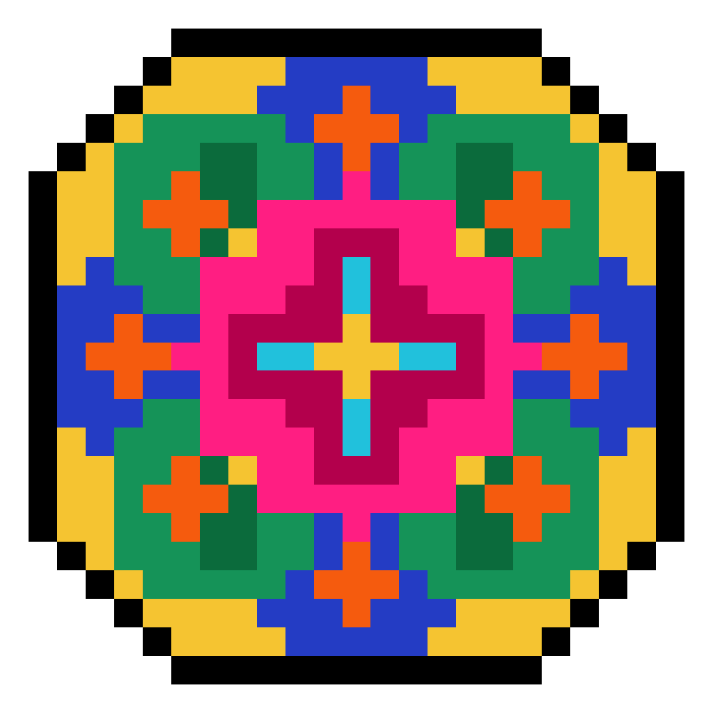

Rang is a collection of color palettes drawn from the visual traditions of
Persian art and culture. Carpets, miniature paintings, tilework, manuscripts,
ceramics, and architecture become practical color schemes for maps, figures,
and creative work.

The name Rang (Persian: رنگ) means "color" in Persian. I created this
collection to carry the character of these artworks into data visualization,
cartography, and creative coding.

Every palette traces to a documented source photograph. Its page explains the
artwork, records where each color appears, and reports the nearest match found
in the sampled image. It also shows pairwise color separation under four
viewing simulations and includes sample plots for a practical visual check.

Use Rang with Python, R, ArcGIS Pro, QGIS, GeoLibre and HEC-RAS. The same
palette can move easily from code to maps and hydraulic models.

Created by **Mohsen Tahmasebi Nasab, PhD**. Read
[the story behind Rang](https://hydromohsen.com/blog/the-story-behind-rang/).

## Contents

[Palettes](#palettes) | [Install](#install) | [Use](#use-the-palettes) | [How they are made](#how-palettes-are-made) | [Contribute](#contributing) | [Credits and license](#credits-and-license)

## Palettes

Each entry pairs the artwork with its palette. Follow the link for sample
plots, notes on each color and the color-vision checks.

<!-- gallery:start -->

### Kashan

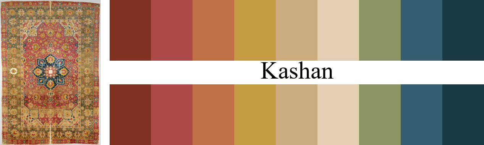

Silk Kashan Carpet, 16th century. The Metropolitan Museum of Art, New York. [Reference](https://www.metmuseum.org/art/collection/search/451470) Persian: کاشان. Say it kah-SHAHN.

`#7f3020 #ab4a47 #c07049 #c59b46 #ccac7e #e2cfb1 #8a9463 #345f72 #1a3b45`

[Sample plots and full details](docs/kashan/README.md)

***

### Golestan

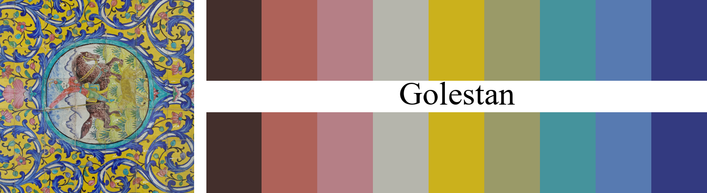

Hunting-scene tile panel at Golestan Palace, photographed 2018. Golestan Palace, UNESCO World Heritage Site. Photo by Mohsen Tahmasebi Nasab, 2018. [Reference](https://whc.unesco.org/en/list/1422/) Persian: گلستان. Say it goh-leh-STAHN, Persian for rose garden.

`#432f2c #ae6259 #b57f86 #b5b5ac #cbb11c #9a9a68 #45939c #577ab1 #333a80`

[Sample plots and full details](docs/golestan/README.md)

***

### Termeh

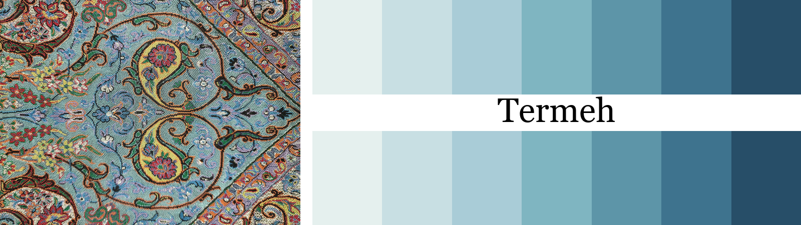

Termeh cloth with boteh motifs, photographed 2026. Yazd textile tradition. Photo by Mohsen Tahmasebi Nasab, 2026. [Reference](https://asia-archive.si.edu/object/S2017.14/) Persian: ترمه. Say it tehr-MEH.

I made this sequential ramp for water surface elevation and depth rasters. It follows the termeh's blue ground from foam light to deep indigo. The color names come from the water they are meant to carry: Foam Mist, Glacial Blue, Powder Aqua, River Teal, Slate Blue, Deep Channel and Night Current.

`#e5f0ee #c8dfe3 #a9ccd7 #7fb5c1 #5d95a8 #3e738e #274e68`

[Sample plots and full details](docs/termeh/README.md)

***

### Khatam

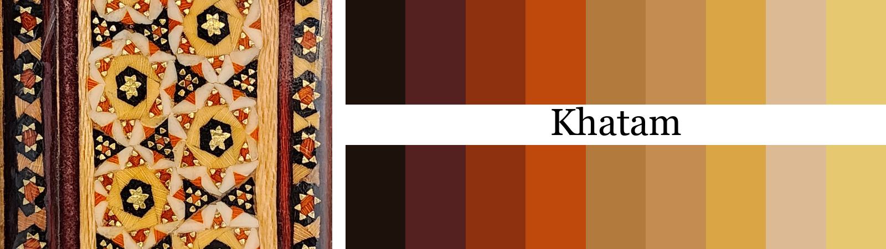

Khatam panel with brass stars, 2026. Khatam marquetry tradition. Photos by Mohsen Tahmasebi Nasab, 2018 and 2026. [Reference](https://www.iranicaonline.org/articles/isfahan-xiii-crafts/) Persian: خاتم. Say it khaw-TAM.

This warm ramp comes from khatam marquetry, the Persian craft of laying wood, bone and brass into star patterns. It moves from ebony dark to brass bright. For categories, the pick order jumps between wood, metal and bone.

`#1c110b #542020 #8d310e #bf480d #b27a3c #c58c51 #d9a545 #dbba94 #e5c870`

[Sample plots and full details](docs/khatam/README.md)

***

### Nasir

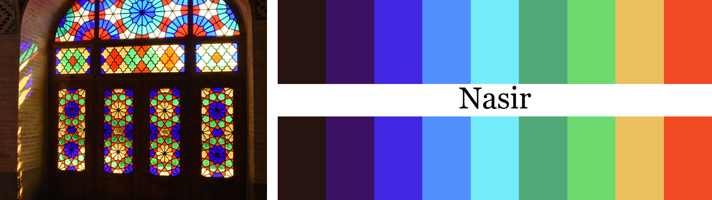

Stained-glass window at Nasir al-Mulk Mosque, 2018. Nasir al-Mulk Mosque. Photograph by Tpmehdi, 2018. [Reference](https://commons.wikimedia.org/wiki/File:DSC_0277-%D9%85%D8%B3%D8%AC%D8%AF_%D9%86%D8%B5%DB%8C%D8%B1%D8%A7%D9%84%D9%85%D9%84%DA%A9.jpg) Persian: نصیر. Say it nah-SEER, from Nasir al-Mulk Mosque in Shiraz.

This vivid spectrum comes from the stained glass of Nasir al-Mulk Mosque in Shiraz. Violet and cobalt open into cyan and green, then turn through gold to vermilion. I use it when a map or chart needs bright colors and strong contrast.

`#261410 #3b1261 #4027e1 #518ffd #74ecf9 #50a877 #6dd96f #ebc05c #f04a23`

[Sample plots and full details](docs/nasir/README.md)

***

### Mina

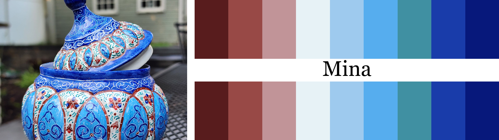

Lidded enamel vessel, photographed 2026. Persian enamelwork tradition. Photo by Mohsen Tahmasebi Nasab, 2026. [Reference](https://www.iranicaonline.org/articles/enamel/) Persian: مینا. Say it mee-NAH, Persian for enamel.

Mina is Persian for enamel, while minakari is the craft of decorating metal with it. This diverging palette comes from a lidded minakari vessel. Copper and rose meet at an enamel-white center, then turn toward pale blue, turquoise, cobalt and indigo. The blue side dominates, just as it does on the piece.

`#581c1d #984946 #c19498 #e7f2f6 #9ecaee #56adee #4090a2 #193caa #07187b`

[Sample plots and full details](docs/mina/README.md)

***

### Rostan

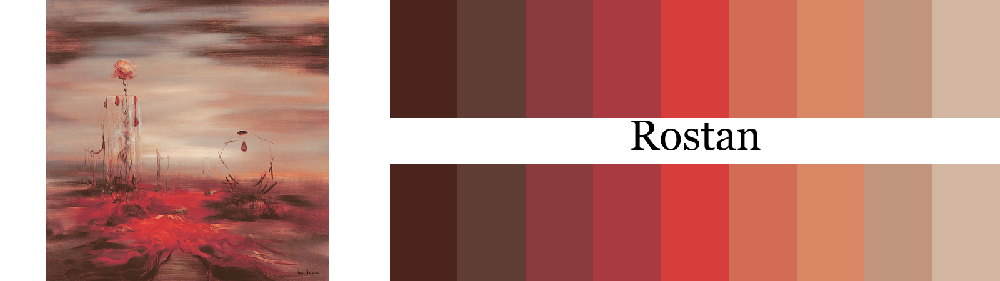

Growing in thus Way, 1972, 140 x 140 cm. Iran Darroudi official website. Artwork by Iran Darroudi. [Reference](https://www.irandarroudi.com/en/paints) Persian: رستن. Say it rohs-TAN, from the Persian title Az In Gooneh Rostan.

Rostan comes from Iran Darroudi's 1972 painting Az In Gooneh Rostan, or Growing in thus Way. Near-black earth rises through wine and urgent crimson, then opens into coral, dusty rose and a pale sky. To me, the red feels both wounded and alive, while the quieter tones hold the scene in stillness.

`#4b241e #603d34 #883c3e #aa3a41 #d63d3b #d26c55 #d98665 #c0947d #d2b6a1`

[Sample plots and full details](docs/rostan/README.md)

***

### Shahnameh

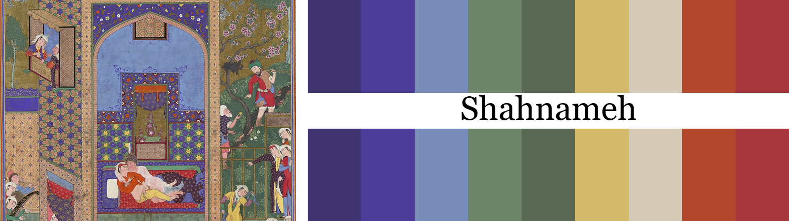

The Wedding of Siyavush and Farangis, Folio 185v from the Shahnama of Shah Tahmasp, ca. 1525-30, painting 28.9 x 18.4 cm, page 47.3 x 32.1 cm. The Metropolitan Museum of Art, New York. [Reference](https://www.metmuseum.org/art/collection/search/452137) Persian: شاهنامه. Say it shah-nah-MEH, Persian for Book of Kings.

Shahnameh comes from the wedding of Siyavush and Farangis. Deep violet and pavilion blue give the page its quiet center, while garden green, gold, parchment and red carry the celebration around it. I wanted the palette to hold both the stillness of the couple and the music outside their room.

`#41356f #4b3d97 #798cb8 #6d866a #596956 #d4b96b #d5c9b7 #b0472c #a6373e`

[Sample plots and full details](docs/shahnameh/README.md)

***

### Gilas

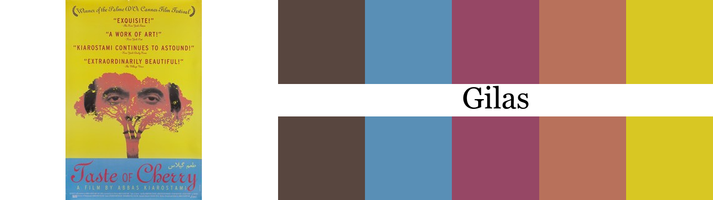

Taste of Cherry promotional poster, 1997. Wikipedia. Promotional poster for Taste of Cherry. [Reference](https://en.wikipedia.org/wiki/File:Tasteofcherryposter.jpg) Persian: گیلاس. Say it gee-LAAS, Persian for cherry.

Gilas takes its five colors from the promotional poster for Abbas Kiarostami's Taste of Cherry. Charcoal and muted blue hold the film's stillness, while mauve, dusty coral, and mustard yellow carry the poster's face, tree, and sunlit field. I kept the set small to match the film's spare visual language.

`#58463f #598fb6 #964765 #b8715b #d8c723`

[Sample plots and full details](docs/gilas/README.md)

***

### Iwan

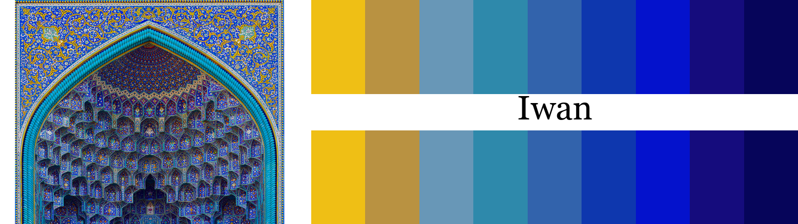

Entrance iwan of the Shah Mosque, 2020. Wikimedia Commons. Photograph by Farzan95, 2020. [Reference](https://commons.wikimedia.org/wiki/File:Shah_mosque_of_isfahan.jpg) Persian: ایوان. Say it ee-VAHN, Persian for a vaulted hall open on one side.

Iwan moves from sunlit yellow into a long run of blues drawn from the tiled entrance iwan of Isfahan's Shah Mosque. Ochre and pale blue form a short threshold before turquoise, lapis, cobalt, ultramarine, indigo and midnight blue take over. I made it for maps that need a clear light-to-dark sequence with most of the visual weight carried by blue.

`#efbf15 #b99241 #6897b7 #2e89ab #3263ac #0e37ae #0412cc #150c7d #06055a`

[Sample plots and full details](docs/iwan/README.md)

<!-- gallery:end -->

## Saying the names

The names are Persian, and they are easy once you see them spelled out. The
stress lands on the last syllable.

| name      | Persian | say it                                | meaning                                             |
| --------- | ------- | ------------------------------------- | --------------------------------------------------- |
| Rang      | رنگ     | rahng, close to the English word rung | color                                               |
| Kashan    | کاشان   | kah-SHAHN                             | a city famous for its carpets and silks             |
| Golestan  | گلستان  | goh-leh-STAHN                         | rose garden, the Qajar palace in Tehran             |
| Termeh    | ترمه    | tehr-MEH                              | a patterned textile associated with Yazd            |
| Khatam    | خاتم    | khaw-TAM                              | marquetry of star patterns in wood, bone and brass  |
| Nasir     | نصیر    | nah-SEER                              | from Nasir al-Mulk Mosque in Shiraz                 |
| Mina      | مینا    | mee-NAH                               | enamel, the material used in minakari               |
| Rostan    | رستن    | rohs-TAN                              | to grow, from the painting's Persian title          |
| Shahnameh | شاهنامه | shah-nah-MEH                          | Book of Kings, the wedding of Siyavush and Farangis |
| Gilas     | گیلاس   | gee-LAAS                              | cherry, the fruit                                   |
| Iwan      | ایوان   | ee-VAHN                               | a vaulted hall open on one side                     |

Each palette page repeats the pronunciation beside its name.

## Install

### Python

```
pip install rang-palettes
```

The package itself has no required dependencies. The matplotlib helpers
(`cmap`, `register` and `set_palette`) need matplotlib, which comes with:

```
pip install "rang-palettes[plots]"
```

Import it as `rang`. To install the unreleased version straight from this
repository instead:

```
pip install "git+https://github.com/mohsennasab/Rang.git#subdirectory=python"
```

### R

```r
install.packages("remotes")
remotes::install_github("mohsennasab/Rang", subdir = "r")
```

The ggplot2 scales need ggplot2 3.5.0 or newer. Everything else works
without it.

### ArcGIS Pro, QGIS, GeoLibre and HEC-RAS

No Rang install is needed. Grab the files from [arcgis/](arcgis/),
[qgis/](qgis/), [geolibre/](geolibre/) or [hecras/](hecras/) and follow the
matching guide, [ArcGIS](arcgis/README.md), [QGIS](qgis/README.md),
[GeoLibre](geolibre/README.md) or [HEC-RAS](hecras/README.md).

## Use the palettes

Want to try Rang without setting anything up locally? Start with the
[Colab-ready Python, R and hydrologic mapping examples](examples/).

A palette stores its ramp and a pick order. Ask for a few colors and Rang
selects a well-separated subset. Ask for more than the palette contains and
Rang interpolates along the ramp.

### Python

```python
import rang

rang.list_palettes()                     # available names
rang.rang("Golestan")                    # the full ramp
rang.rang("Golestan", 4)                 # four well separated colors
rang.rang("Termeh", 100, "continuous")   # smooth ramp for gridded data

# matplotlib
import matplotlib.pyplot as plt
plt.imshow(data, cmap=rang.cmap("Termeh"))       # smooth
plt.imshow(data, cmap=rang.cmap("Termeh", 6))    # six fixed steps

# categorical plots pick up the palette on their own
rang.set_palette("Golestan")

# where the colors came from
rang.source("Golestan")
```

Calling `rang.register()` once adds every palette to matplotlib under a
`rang:` name. After that any library that takes a colormap name can use
Rang, including xarray, geopandas, rioxarray and seaborn, without knowing
anything about Rang.

```python
rang.register()

raster.plot(cmap="rang:Termeh")          # xarray
gdf.plot(column="depth", cmap="rang:Iwan_r")     # geopandas, reversed
```

### R

```r
library(Rang)

names(rang_palettes)                     # available names
rang("Golestan")                         # the full ramp, prints as a swatch
rang("Golestan", 4)                      # four well separated colors
rang("Termeh", 100, type = "continuous") # smooth ramp
```

With ggplot2 there is a scale for each case, so the colors do not have to be
built by hand.

```r
library(ggplot2)

# a categorical variable
ggplot(iris, aes(Species, Petal.Length, fill = Species)) +
  geom_violin() +
  scale_fill_rang_d("Golestan")

# a numeric variable
ggplot(faithfuld, aes(waiting, eruptions, fill = density)) +
  geom_raster() +
  scale_fill_rang_c("Termeh")
```

Every scale comes in four spellings, `scale_fill_*` and `scale_color_*` with
a `scale_colour_*` alias, and `_d` for categories against `_c` for numbers.
Pass `direction = -1` to any of them to run the palette the other way.

### ArcGIS Pro

Import [arcgis/Rang.stylx](arcgis/Rang.stylx) once through the Catalog pane.
Each palette appears as smooth and discrete color schemes, with its individual
swatches in the color picker. The schemes work with integer and floating-point
rasters. Steps are in the [ArcGIS guide](arcgis/README.md).

### QGIS

Import [qgis/Rang.xml](qgis/Rang.xml) once through the Style Manager and every
palette appears in the color ramp dropdowns, smooth and discrete. The `.gpl`
files add the exact colors to the QGIS color picker. Steps are in the
[QGIS guide](qgis/README.md).

### GeoLibre

Copy a prepared color list from [geolibre/Rang.txt](geolibre/Rang.txt) into a
raster Custom color ramp. For vectors, use the matching graduated or
categorical list to replace the generated class colors. A machine-readable
bundle for notebooks and project tooling is available as
[geolibre/Rang.json](geolibre/Rang.json). The [GeoLibre guide](geolibre/README.md)
covers raster layers, vector layers, legends, colorbars and Jupyter use.

### HEC-RAS

Import [hecras/Rang-All.xml](hecras/Rang-All.xml) through the RAS Mapper
Surface Fill window to add the full collection, or download one palette from
the [hecras folder](hecras/). The [HEC-RAS guide](hecras/README.md) walks
through the interface step by step.

## How palettes are made

I use the same basic process for each palette. The complete walkthrough is in
[CONTRIBUTING.md](CONTRIBUTING.md).

1. Colors are sampled from a photo of the artwork by k-means clustering in
   CIELAB, run region by region rather than over the whole image so small
   motifs are not averaged away by large fields of background. Sources are
   museum open access photos or the contributor's own photographs.
2. The candidate set is trimmed to a ramp of five to twelve colors and checked
   against a sampled, reduced copy of the photo. Each palette page publishes
   the nearest CIEDE2000 distance found in that sample.
3. Separation is measured under normal vision and simulated protanopia,
   deuteranopia and tritanopia. A pick order is computed so that the first few
   discrete colors stay as far apart as possible under every vision type.
4. One build command regenerates the Python, R, ArcGIS, QGIS, GeoLibre and
   HEC-RAS files, the sample plots and the documentation, so every palette in
   the collection is packaged the same way.

The sample pages use real data on purpose: one day of NOAA AORC 1 km rainfall
from Hurricane Harvey, a CONUS elevation grid from AWS Open Data, and, for the
water palettes, a USGS flood profile and stream network from Ithaca, New York.
The fetch scripts live in [tools/](tools/README.md).

## Contributing

New palettes are welcome. The bar is that the source is Persian art with a
photograph you have the rights to share, the colors verifiably come from that
photograph, and the palette page is produced by the standard tooling so it
matches the rest of the collection. [CONTRIBUTING.md](CONTRIBUTING.md) walks
through the whole process, from picking an artwork to opening a pull request,
including the sample code for extracting colors from a photo and adjusting any
color that does not sit right.

The two [palette-making notebooks](tools/README.md) run in Google Colab and
make every input and decision easy to find. Notebook 1 takes an uploaded
artwork through regions, k-means, curation, adjustment, checking, and replay.
Notebook 2 shows incomplete source details as warnings and lets you add or
correct only the fields you choose. It then turns the verified workflow ZIP
into a proposal with repository files, documentation images, software test
files, and a pull request draft.

Each palette page also shows its saved extraction regions on the source
photograph. The matching recipe keeps the pixel coordinates, normalized
coordinates, k-means settings and color decisions together.

## Repository layout

```
palettes/    one json per palette, the single source of truth
recipes/     saved regions, k-means settings and adjustment history
sources/     contributor photographs referenced by the palette files
python/      pip installable package, reads generated _palettes.py
r/           R package, reads generated palettes_data.R
arcgis/      Rang.stylx style file and the ArcGIS Pro guide
qgis/        style file, .gpl swatches and the QGIS guide
geolibre/    copy-ready and machine-readable color lists plus a usage guide
hecras/      HEC-RAS custom color-ramp imports and the interface guide
tools/       complete Colab workflow notebooks and command-line tools
docs/        one page per palette with regions, previews and sample plots
data/        small rainfall, elevation and flood-depth grids used by the examples
examples/    Colab-ready palette and hydrologic mapping notebooks
```

## Credits and license

Rang source code is licensed under the [MIT License](LICENSE). To the extent
that copyright or database rights apply, the palette names, color values,
descriptions, and ordering are dedicated to the public domain under
[CC0 1.0 Universal](LICENSES/CC0-1.0.txt). The palettes may therefore be used
for any purpose without permission or credit, though a link back is always
appreciated. The complete file-by-file scope is in
[the licensing guide](LICENSES/README.md).

Artwork photographs are not covered by the MIT License or CC0 unless stated
otherwise. The Golestan, Termeh, Khatam and Mina source photographs remain
copyright Mohsen Tahmasebi Nasab, with all rights reserved. The Kashan palette
draws on the
[Silk Kashan Carpet](https://www.metmuseum.org/art/collection/search/451470)
at The Metropolitan Museum of Art, whose qualifying Open Access images are
available under CC0. Shahnameh also uses a public-domain image from The Met's
Open Access collection. Its folio shows the wedding of Siyavush and Farangis.
The Golestan palette comes from a photograph of the
tilework at
[Golestan Palace](https://whc.unesco.org/en/list/1422/) in Tehran, taken by
Mohsen Tahmasebi Nasab in 2018. The Termeh palette comes from his photograph
of a termeh cloth, 2026. The Smithsonian's
[termeh record](https://asia-archive.si.edu/object/S2017.14/) documents the
Yazd tradition and the boteh motif. The Khatam palette comes from his
photographs of khatam marquetry, 2026, and of a handicraft shop in the
Isfahan bazaar, 2018. The Encyclopaedia Iranica article on
[crafts in Isfahan](https://www.iranicaonline.org/articles/isfahan-xiii-crafts/)
documents the craft's history in Shiraz, Isfahan and Tehran.
The Nasir palette draws on a
[stained-glass photograph](https://commons.wikimedia.org/wiki/File:DSC_0277-%D9%85%D8%B3%D8%AC%D8%AF_%D9%86%D8%B5%DB%8C%D8%B1%D8%A7%D9%84%D9%85%D9%84%DA%A9.jpg)
by Tpmehdi, 2018, and an
[interior photograph](https://commons.wikimedia.org/wiki/File:Nasir_al-_mulk_mosque%2C_Shiraz.jpg)
by MohammadReza Domiri Ganji, 2013. Both are licensed under
[CC BY-SA 4.0](https://creativecommons.org/licenses/by-sa/4.0/).
The Mina palette comes from Mohsen Tahmasebi Nasab's photograph of a
lidded enamel vessel, taken in 2026. Its setting photograph,
[Iranian vitreous enamel, cropped](https://commons.wikimedia.org/wiki/File:Iranian_vitreous_enamel_\(cropped\).JPG),
was made by Wikimedia Commons user مانفی in 2012 and cropped by Joalbertine in
2020\. It is licensed under
[CC BY-SA 3.0](https://creativecommons.org/licenses/by-sa/3.0/).

The Rostan palette comes from Iran Darroudi's 1972 painting
*[Growing in thus Way](https://www.irandarroudi.com/en/paints)*. The
low-resolution reference image is all rights reserved and is included only
to identify and discuss the source work.

The Gilas palette comes from the promotional poster for Abbas Kiarostami's
1997 film *Taste of Cherry*. The
[Wikipedia file page](https://en.wikipedia.org/wiki/File:Tasteofcherryposter.jpg)
identifies the poster as copyrighted and non-free. The 220-pixel reference is
included only to identify and discuss the poster and the palette drawn from it.

The Iwan palette uses two photographs of the Shah Mosque in Isfahan. The
[extraction photograph](https://commons.wikimedia.org/wiki/File:Shah_mosque_of_isfahan.jpg)
is by Farzan95, 2020. The
[page photograph](https://commons.wikimedia.org/wiki/File:Mezquita_Shah,_Isfah%C3%A1n,_Ir%C3%A1n,_2016-09-20,_DD_64.jpg)
is by Diego Delso, 2016. Both are licensed under
[CC BY-SA 4.0](https://creativecommons.org/licenses/by-sa/4.0/).

The sample plots use public data: rainfall from the
[NOAA Analysis of Record for Calibration](https://registry.opendata.aws/noaa-nws-aorc/),
elevation from the AWS Open Data
[terrain tiles](https://registry.opendata.aws/terrain-tiles/) built on SRTM,
GMTED2010 and ETOPO1, water surface elevation from the
[USGS flood inundation study of the Ithaca creeks](https://www.sciencebase.gov/catalog/item/5b757eb6e4b0f5d5787fe461),
and stream networks from the
[USGS Network Linked Data Index](https://api.water.usgs.gov/nldi/), with
NHDPlusV2 stream order from [USGS Fabric](https://api.water.usgs.gov/docs/fabric-pygeoapi/).
Detailed source status, requested credits, and data notices are recorded in
[the third-party notices](THIRD_PARTY_NOTICES.md).

The package interface tries to follow the conventions set by
[MetBrewer](https://github.com/BlakeRMills/MetBrewer) and
[wesanderson](https://github.com/karthik/wesanderson).
