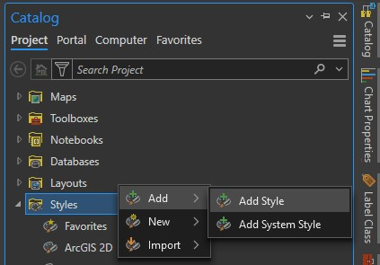

# Rang in ArcGIS Pro

One file, written by `tools/build.py`:

| file | contents |
|---|---|
| `Rang.stylx` | every palette as an ArcGIS Pro style, colors plus smooth and discrete color schemes |

ArcGIS Pro stores styles as `.stylx` database files. Import this file once to
add the collection to a project:

1. Open the **Catalog** pane and find **Styles**.
2. Right click **Styles**, then **Add**, then **Add Style** (on some versions
   this sits under **Insert**, **Styles**).
3. Pick `Rang.stylx`.

Every palette then shows up in two places:

- Each **color scheme dropdown**, symbology for stretched rasters, unclassed
  and graduated colors, unique values, charts. The plain name, such as
  "Rang - Termeh", is the smooth ramp. The name marked discrete holds the
  exact palette steps for classified data.
- Each **color picker**, under the Rang category, one swatch per palette
  color, named with its hex code.

Because a color scheme lives in the symbology rather than the dataset, this
works with any raster type, floating point included. For a depth or water
surface elevation grid, open **Symbology**, choose **Stretch** or
**Classify**, and pick the Rang scheme from the dropdown.

## Suggested pairings

Sequential data such as depth, water surface elevation or rainfall reads
best with a smooth scheme, and Termeh was drawn for exactly that. Categorical
maps read best with a discrete scheme, which keeps the exact palette colors
as fixed steps in ramp order.
