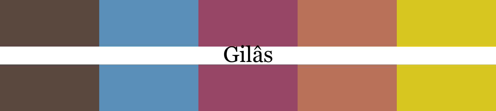
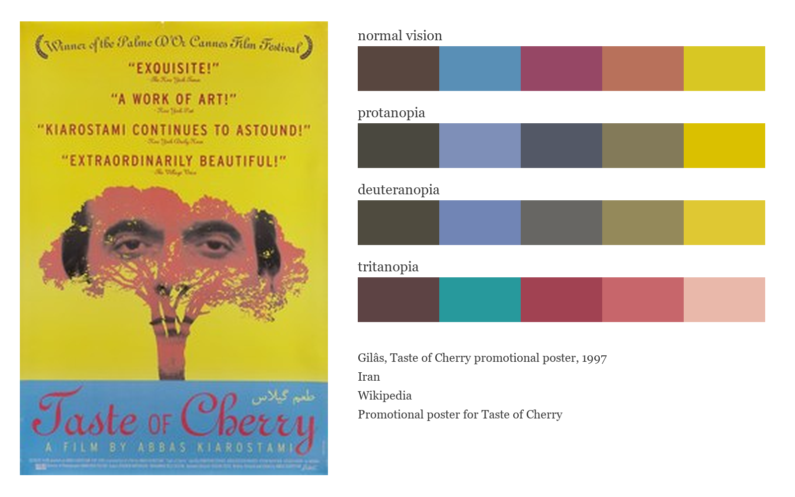
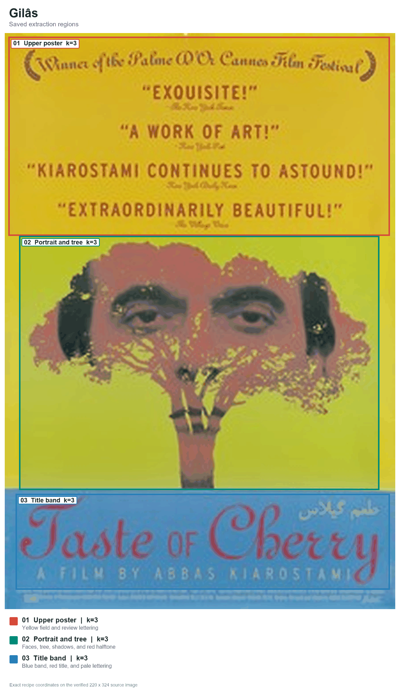
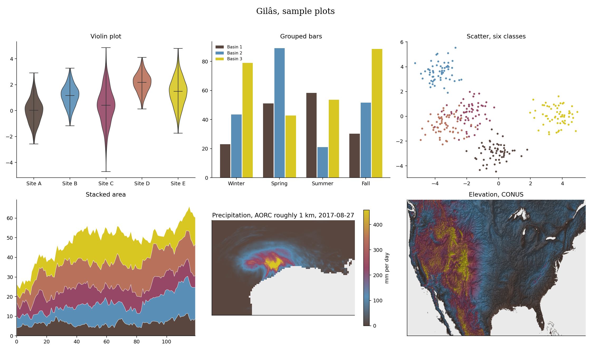

# Gilâs (Persian: گیلاس, say it gee-LAAS, Persian for cherry)



Gilâs takes its five colors from the promotional poster for Abbas Kiarostami's Taste of Cherry. Charcoal and muted blue hold the film's stillness, while mauve, dusty coral, and mustard yellow carry the poster's face, tree, and sunlit field. I kept the set small to match the film's spare visual language.

## Source

Taste of Cherry promotional poster, 1997.
Printed film poster.
Wikipedia.
Promotional poster for Taste of Cherry.
Poster for the 1997 film directed by Abbas Kiarostami.

[Poster file page](https://en.wikipedia.org/wiki/File:Tasteofcherryposter.jpg). Copyrighted film poster, all rights reserved. Wikipedia uses its copy under a fair-use rationale that does not grant a reuse license. This 220-pixel reference is included for identification and commentary only.

## The story

Taste of Cherry follows Mr. Badii as he drives through the dry hills outside Tehran, looking for someone who will return the next morning and either help him from his grave or bury him. Kiarostami leaves the reason for his despair unstated and lets long drives and conversations carry the film.

The film turns when a taxidermist recalls how the taste of fruit drew him back toward ordinary life. [Stephen Holden's 1998 review](https://archive.nytimes.com/www.nytimes.com/library/film/032098taste-film-review.html) reads that conversation as the moment the film finds a lyrical voice and simple sensory pleasures press against despair. The final video coda opens the solitary story back onto filmmaking and life.

Released in 1997, Taste of Cherry won the Palme d'Or at the Cannes Film Festival. The [film record](https://en.wikipedia.org/wiki/Taste_of_Cherry) gives its original Persian title as طعم گیلاس.

## Colors

| position | hex | drawn from | nearest sample |
|---|---|---|---|
| 1 | `#58463f` | charcoal brown, the face and deepest tree shadows | 1.6 |
| 2 | `#598fb6` | muted blue, the title band | 0.6 |
| 3 | `#964765` | cherry red, the title lettering against blue | 1.5 |
| 4 | `#b8715b` | dusty coral, the portrait and tree canopy | 0.8 |
| 5 | `#d8c723` | mustard yellow, the broad poster field | 0.1 |

The last column shows the CIEDE2000 distance to the closest sampled color in
the source photo. Lower numbers mean a closer match.

## The palette beside the artwork



## Extraction regions



These are the saved sampling areas used for CIELAB k-means. The exact pixel
coordinates, normalized coordinates and k values are recorded in the
[Gilâs recipe](../../recipes/gilas.json). The regions make the
extraction repeatable. Choosing and refining the final colors still depends
on the artwork and the contributor's eye.

## Sample plots



The rainfall map uses one day of NOAA AORC precipitation on a roughly 1 km grid.
Run `python tools/make_samples.py gilas` to remake the plots. Add
`--dem your_dem.tif` to use your own elevation raster.

## Separation and color vision

| vision | min CIEDE2000 | mean |
|---|---|---|
| normal vision | 20.7 | 39.5 |
| protanopia | 14.4 | 33.5 |
| deuteranopia | 10.9 | 32.0 |
| tritanopia | 13.6 | 36.4 |

The lowest score is 10.9. Rang's cutoff is 8, so all pairwise scores are above it.

When you ask for fewer colors, the stored pick order spreads them out. Check the finished figure when color distinction matters.

## Use it

Python

```python
import rang
rang.rang("Gilâs", 5)
rang.cmap("Gilâs")
```

R

```r
library(Rang)
rang("Gilâs", 5)
```

ArcGIS Pro users get every palette by importing
[arcgis/Rang.stylx](../../arcgis/Rang.stylx) once, with steps in the
[ArcGIS guide](../../arcgis/README.md). QGIS users can import
[qgis/Rang.xml](../../qgis/Rang.xml) for the ramps or
[qgis/Gilâs.gpl](../../qgis/Gilâs.gpl) for swatches, see the
[QGIS guide](../../qgis/README.md). HEC-RAS users can import
[hecras/Rang-Gilâs.xml](../../hecras/Rang-Gilâs.xml), see the
[HEC-RAS guide](../../hecras/README.md). GeoLibre users can copy colors from
[geolibre/Rang.txt](../../geolibre/Rang.txt), with steps for raster and vector
layers in the [GeoLibre guide](../../geolibre/README.md).
