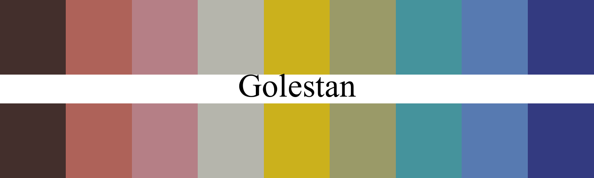
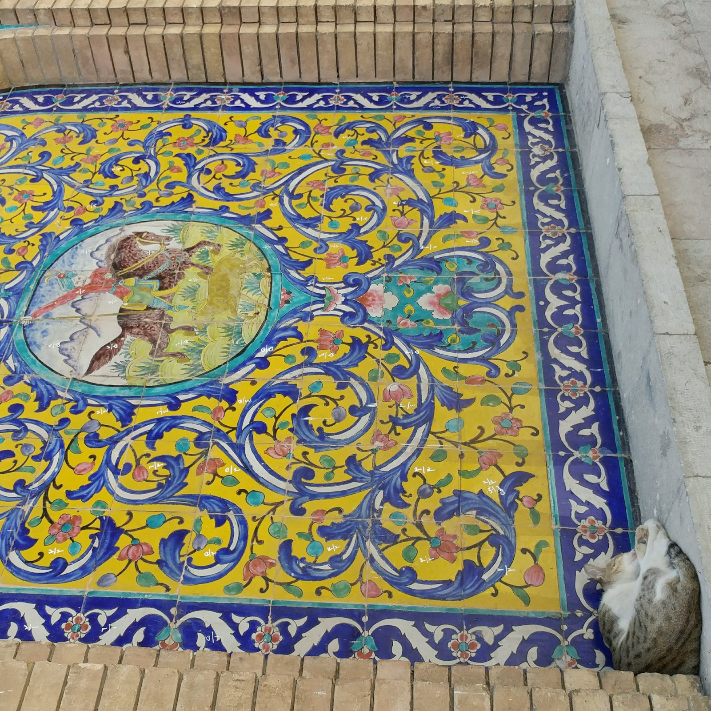
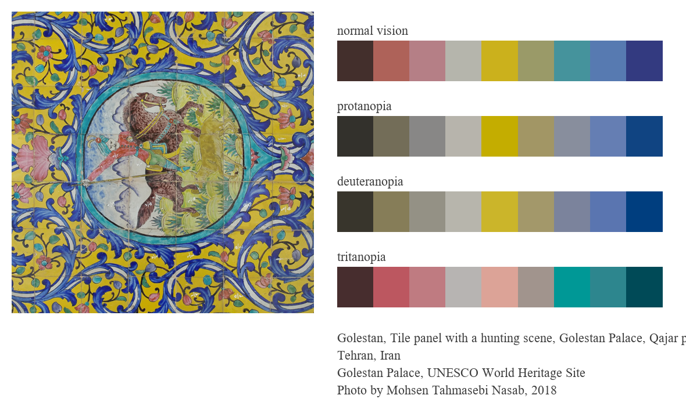
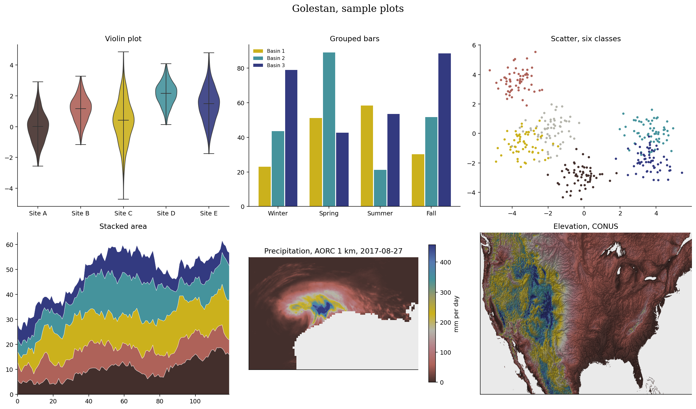

# Golestan (say it goh-leh-STAHN, Persian for rose garden)



## Source

Tile panel with a hunting scene, Golestan Palace, Qajar period. Tehran, Iran.
Glazed polychrome tilework.
Golestan Palace, UNESCO World Heritage Site.
Photo by Mohsen Tahmasebi Nasab, 2018.

[Reference page](https://whc.unesco.org/en/list/1422/). photographer's own work, contributed to the project.

## The setting



The panel in place at the palace, with a resident cat.

## Colors

| position | hex | drawn from | nearest pixel |
|---|---|---|---|
| 1 | `#432f2c` | dark umber, outlines and the hunter's horse | 0.3 |
| 2 | `#ae6259` | coral red, blossoms and the rider's coat | 0.7 |
| 3 | `#b57f86` | rose pink, flowers among the scrollwork | 0.4 |
| 4 | `#b5b5ac` | ivory, tile ground of the medallion | 0.5 |
| 5 | `#cbb11c` | golden yellow, the field | 0.0 |
| 6 | `#9a9a68` | pale olive, the hunting ground | 0.7 |
| 7 | `#45939c` | turquoise, the medallion ring | 0.0 |
| 8 | `#577ab1` | azure, lit edges of the scrollwork | 0.3 |
| 9 | `#333a80` | cobalt, the arabesque scrolls | 0.3 |

The nearest pixel column is the CIEDE2000 distance from each palette color to
the closest pixel in the source photo. Small numbers mean the color is really
in the artwork.

## The palette beside the artwork



## Sample plots



The rainfall panel is real data, one day of NOAA AORC 1 km precipitation.
Regenerate this page with `python tools/make_samples.py golestan`, and
pass `--dem your_dem.tif` to draw the elevation panel from your own raster.

## Separation and color vision

| vision | min CIEDE2000 | mean |
|---|---|---|
| normal vision | 12.1 | 36.4 |
| protanopia | 8.4 | 30.4 |
| deuteranopia | 9.7 | 31.7 |
| tritanopia | 8.0 | 34.4 |

The worst case across the four vision types is 8.0, so this palette
passes the collection's colorblind friendliness threshold of 8.
Discrete picks use the stored order, which was chosen to keep the first few
colors as far apart as possible under every vision type.

## Use it

Python

```python
import rang
rang.rang("Golestan", 5)
rang.cmap("Golestan")
```

R

```r
library(Rang)
rang("Golestan", 5)
```

ArcGIS Pro colormaps are in [arcgis/Golestan.clr](../../arcgis/Golestan.clr) and
[arcgis/Golestan_continuous.clr](../../arcgis/Golestan_continuous.clr), with steps
in the [ArcGIS guide](../../arcgis/README.md). QGIS users can import
[qgis/Rang.xml](../../qgis/Rang.xml) for the ramps or
[qgis/Golestan.gpl](../../qgis/Golestan.gpl) for swatches, see the
[QGIS guide](../../qgis/README.md).
