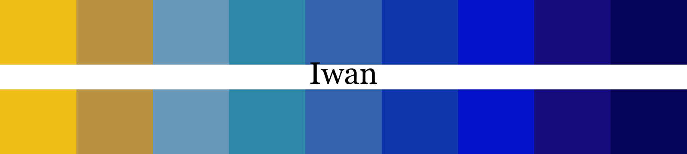
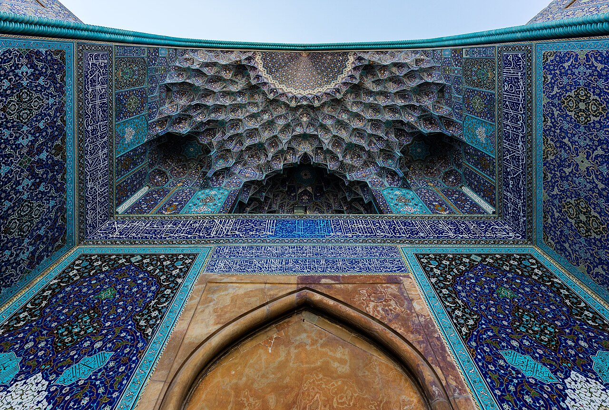
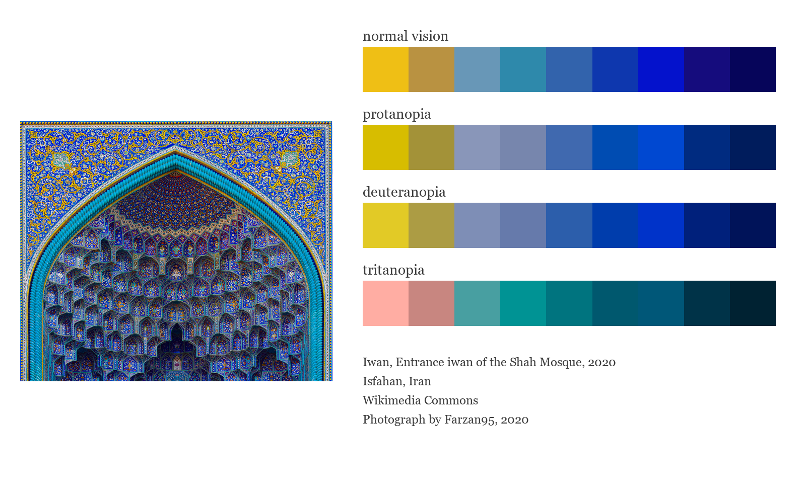
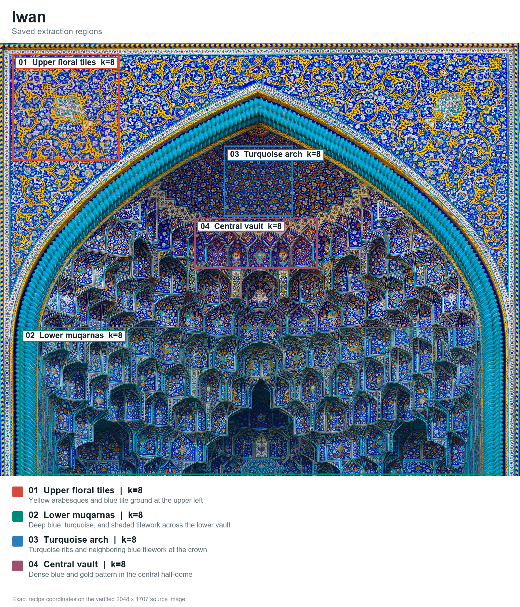
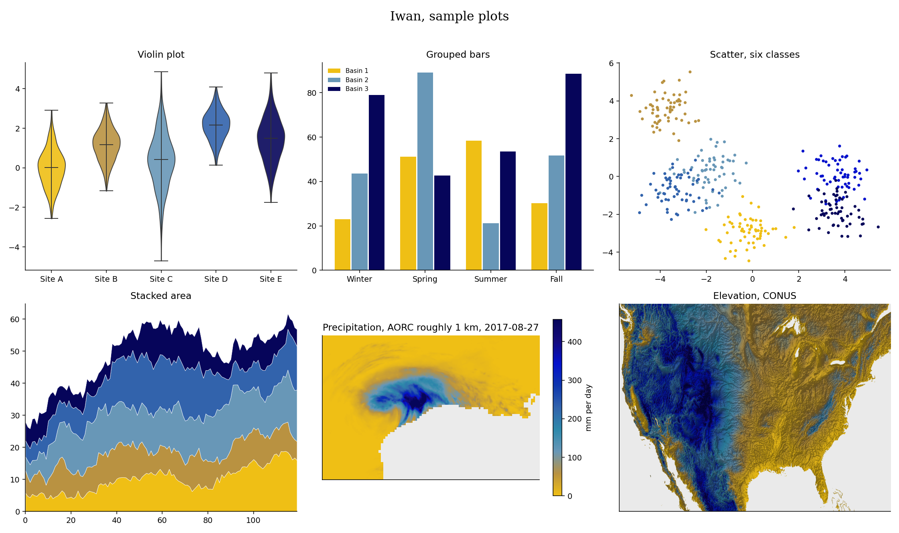

# Iwan (Persian: ایوان, say it ee-VAHN, Persian for a vaulted hall open on one side)



Iwan moves from sunlit yellow into a long run of blues drawn from the tiled entrance iwan of Isfahan's Shah Mosque. Ochre and pale blue form a short threshold before turquoise, lapis, cobalt, ultramarine, indigo and midnight blue take over. I made it for maps that need a clear light-to-dark sequence with most of the visual weight carried by blue.

## Source

Entrance of the Shah Mosque of Isfahan, 2020.
Digital photograph.
Wikimedia Commons.
Photograph by Farzan95, 2020.

[Photograph and license record](https://commons.wikimedia.org/wiki/File:Shah_mosque_of_isfahan.jpg). Licensed under [CC BY-SA 4.0](https://creativecommons.org/licenses/by-sa/4.0/). Rang gallery images use resized adaptations.

## The story

An iwan, or ایوان in Persian, is a vaulted space that opens on one side to a courtyard. The form developed in pre-Islamic Iran and became closely tied to Persian architecture. In a four-iwan mosque, one rises from the center of each side of the courtyard. [Smarthistory's guide to mosque architecture](https://smarthistory.org/common-types-of-mosque-architecture/) follows this form from its Iranian roots into later Islamic buildings.

The Shah Mosque stands on the south side of Naqsh-e Jahan Square and was built for Shah Abbas I in the early seventeenth century. Its entrance faces the square, while the prayer hall turns toward Mecca. A passage through the entrance iwan handles that change in direction. [UNESCO's Meidan Emam record](https://whc.unesco.org/en/list/115/) describes the deep portal, its tiled half-dome and the angled route into the courtyard.

The blue surface is not a single blue. Turquoise, lapis, white, green and yellow meet in floral scrolls, calligraphy and the small cells of the muqarnas vault. Safavid builders used haft-rangi, or seven-color tilework, to paint several colors on one tile before firing it. [Smarthistory's introduction to Safavid art](https://smarthistory.org/safavids-intro/) explains how this method gave the Shah Mosque its layered, light-catching color. I kept the yellow at one end of the palette, then let the many blues carry the rest of the ramp.

## The setting



Looking up into the tiled entrance iwan of the Shah Mosque.

Photograph by Diego Delso, 2016. [Context photograph source](https://commons.wikimedia.org/wiki/File:Mezquita_Shah,_Isfah%C3%A1n,_Ir%C3%A1n,_2016-09-20,_DD_64.jpg). Licensed under [CC BY-SA 4.0](https://creativecommons.org/licenses/by-sa/4.0/).

## Colors

| position | hex | drawn from | nearest sample |
|---|---|---|---|
| 1 | `#efbf15` | tile yellow, the curling floral vines in the upper panel | 0.3 |
| 2 | `#b99241` | golden ochre, shaded yellow leaves and outlines | 0.9 |
| 3 | `#6897b7` | pale blue, weathered tile and floral highlights | 0.7 |
| 4 | `#2e89ab` | turquoise, bright glazed ribs around the lower vault | 0.6 |
| 5 | `#3263ac` | lapis blue, the broad floral tile ground | 0.4 |
| 6 | `#0e37ae` | cobalt, darker outlines around the upper arabesques | 0.3 |
| 7 | `#0412cc` | ultramarine, the most saturated blue tiles | 0.1 |
| 8 | `#150c7d` | indigo, shadowed geometry in the central muqarnas | 0.5 |
| 9 | `#06055a` | midnight blue, the deepest recess of the half-dome | 0.4 |

The last column shows the CIEDE2000 distance to the closest sampled color in
the source photo. Lower numbers mean a closer match.

## The palette beside the artwork



## Extraction regions



These are the saved sampling areas used for CIELAB k-means. The exact pixel
coordinates, normalized coordinates and k values are recorded in the
[Iwan recipe](../../recipes/iwan.json). The regions make the
extraction repeatable. Choosing and refining the final colors still depends
on the artwork and the contributor's eye.

## Sample plots



The rainfall map uses one day of NOAA AORC precipitation on a roughly 1 km grid.
Run `python tools/make_samples.py iwan` to remake the plots. Add
`--dem your_dem.tif` to use your own elevation raster.

## Separation and color vision

| vision | min CIEDE2000 | mean |
|---|---|---|
| normal vision | 5.7 | 40.4 |
| protanopia | 4.9 | 36.8 |
| deuteranopia | 5.4 | 38.6 |
| tritanopia | 5.0 | 33.3 |

The lowest score is 4.9, below Rang's cutoff of 8.

When you ask for fewer colors, the stored pick order spreads them out. Check the finished figure when color distinction matters.

## Use it

Python

```python
import rang
rang.rang("Iwan", 5)
rang.cmap("Iwan")
```

R

```r
library(Rang)
rang("Iwan", 5)
```

ArcGIS Pro users get every palette by importing
[arcgis/Rang.stylx](../../arcgis/Rang.stylx) once, with steps in the
[ArcGIS guide](../../arcgis/README.md). QGIS users can import
[qgis/Rang.xml](../../qgis/Rang.xml) for the ramps or
[qgis/Iwan.gpl](../../qgis/Iwan.gpl) for swatches, see the
[QGIS guide](../../qgis/README.md). HEC-RAS users can import
[hecras/Rang-Iwan.xml](../../hecras/Rang-Iwan.xml), see the
[HEC-RAS guide](../../hecras/README.md). GeoLibre users can copy colors from
[geolibre/Rang.txt](../../geolibre/Rang.txt), with steps for raster and vector
layers in the [GeoLibre guide](../../geolibre/README.md).
