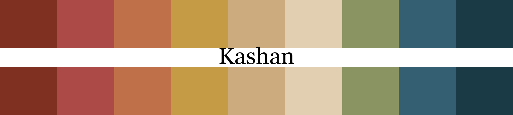
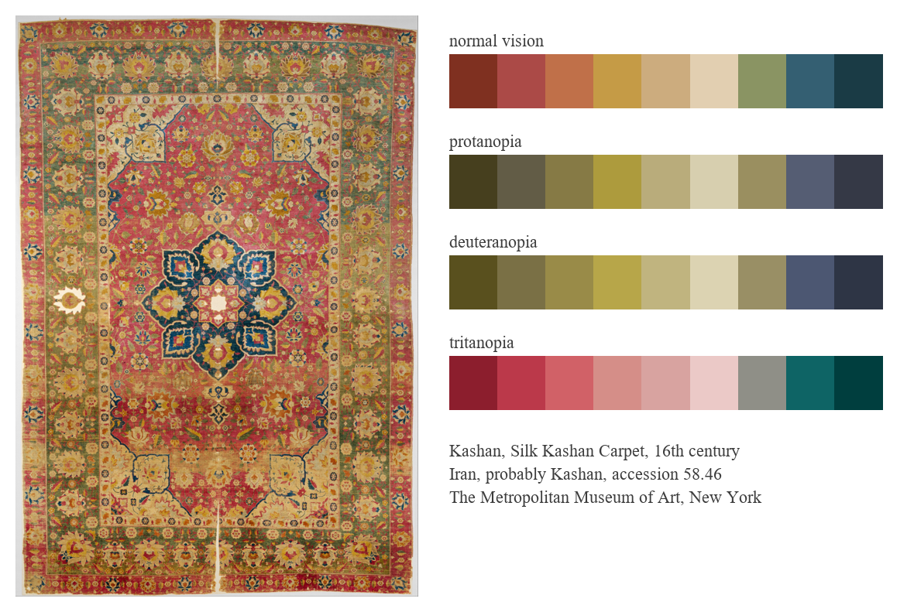
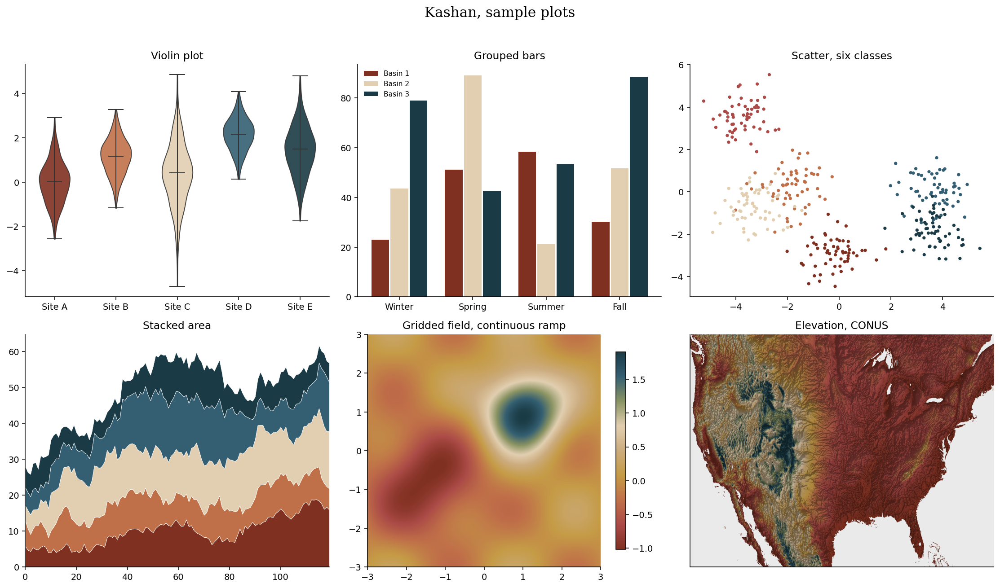

# Kashan (Persian: کاشان, say it kah-SHAHN)



## Source

Silk Kashan Carpet, 16th century. Made in Iran, probably Kashan.
Silk (warp, weft and pile), asymmetrically knotted pile.
The Metropolitan Museum of Art, New York, Islamic Art, accession 58.46.
Gift of Mrs. Douglas M. Moffat, 1958.

[Object page](https://www.metmuseum.org/art/collection/search/451470) and [full resolution photo](https://images.metmuseum.org/CRDImages/is/original/DT5450.jpg), released by the museum under open access.

## Colors

| position | hex | drawn from | nearest sample |
|---|---|---|---|
| 1 | `#7f3020` | dark red, corner cartouche outlines | 0.9 |
| 2 | `#ab4a47` | rose red of the field | 0.3 |
| 3 | `#c07049` | terracotta | 0.9 |
| 4 | `#c59b46` | golden ochre, medallion palmettes | 0.5 |
| 5 | `#ccac7e` | tan of the border ground | 0.3 |
| 6 | `#e2cfb1` | ivory, medallion star and cartouches | 0.8 |
| 7 | `#8a9463` | sage green, guard border | 2.4 |
| 8 | `#345f72` | mid blue, medallion lobes | 0.5 |
| 9 | `#1a3b45` | indigo, medallion ground | 0.4 |

The nearest sample column is the CIEDE2000 distance from each palette color to
the closest evaluated point in a reduced copy of the source photo. Small
numbers show that a close visual match occurs in the sampled image.

## The palette beside the artwork



## Sample plots



The rainfall panel is real data, one day of NOAA AORC precipitation on a roughly 1 km grid.
Regenerate this page with `python tools/make_samples.py kashan`, and
pass `--dem your_dem.tif` to draw the elevation panel from your own raster.

## Separation and color vision

| vision | min CIEDE2000 | mean |
|---|---|---|
| normal vision | 9.1 | 34.2 |
| protanopia | 7.9 | 28.2 |
| deuteranopia | 5.9 | 28.8 |
| tritanopia | 6.2 | 34.2 |

The worst case across the four vision types is 5.9, so this palette
does not pass the project's CVD separation threshold of 8.
This screening rule is not an accessibility guarantee.
Discrete picks use the stored order, which was chosen to keep the first few
colors as far apart as possible under every vision type.

## Use it

Python

```python
import rang
rang.rang("Kashan", 5)
rang.cmap("Kashan")
```

R

```r
library(Rang)
rang("Kashan", 5)
```

ArcGIS Pro users get every palette by importing
[arcgis/Rang.stylx](../../arcgis/Rang.stylx) once, with steps in the
[ArcGIS guide](../../arcgis/README.md). QGIS users can import
[qgis/Rang.xml](../../qgis/Rang.xml) for the ramps or
[qgis/Kashan.gpl](../../qgis/Kashan.gpl) for swatches, see the
[QGIS guide](../../qgis/README.md). HEC-RAS surface fills are in
[hecras/Kashan.rasmap.xml](../../hecras/Kashan.rasmap.xml), see the
[HEC-RAS guide](../../hecras/README.md). GeoLibre users can copy colors from
[geolibre/Rang.txt](../../geolibre/Rang.txt), with steps for raster and vector
layers in the [GeoLibre guide](../../geolibre/README.md).
