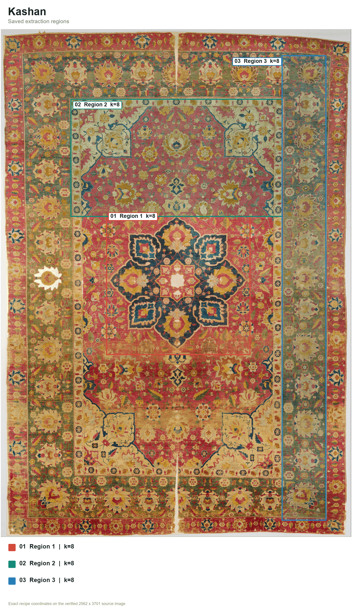

# Kashan (Persian: کاشان, say it kah-SHAHN)


## Source

Silk Kashan Carpet, 16th century. Made in Iran, probably Kashan.
Silk (warp, weft and pile), asymmetrically knotted pile.
The Metropolitan Museum of Art, New York, Islamic Art, accession 58.46.
Gift of Mrs. Douglas M. Moffat, 1958.

[Object page](https://www.metmuseum.org/art/collection/search/451470) and [full resolution photo](https://images.metmuseum.org/CRDImages/is/original/DT5450.jpg), released by the museum under open access.

## Colors

| position | hex | drawn from | nearest sample |
|---|---|---|---|
| 1 | `#7f3020` | dark red, corner cartouche outlines | 0.9 |
| 2 | `#ab4a47` | rose red of the field | 0.3 |
| 3 | `#c07049` | terracotta | 0.9 |
| 4 | `#c59b46` | golden ochre, medallion palmettes | 0.5 |
| 5 | `#ccac7e` | tan of the border ground | 0.3 |
| 6 | `#e2cfb1` | ivory, medallion star and cartouches | 0.8 |
| 7 | `#8a9463` | sage green, guard border | 2.4 |
| 8 | `#345f72` | mid blue, medallion lobes | 0.5 |
| 9 | `#1a3b45` | indigo, medallion ground | 0.4 |

The last column shows the CIEDE2000 distance to the closest sampled color in
the source photo. Lower numbers mean a closer match.

## The palette beside the artwork


## Extraction regions



These are the saved sampling areas used for CIELAB k-means. The exact pixel
coordinates, normalized coordinates and k values are recorded in the
[Kashan recipe](../../recipes/kashan.json). The regions make the
extraction repeatable. Choosing and refining the final colors still depends
on the artwork and the contributor's eye.

## Sample plots


The rainfall map uses one day of NOAA AORC precipitation on a roughly 1 km grid.
Run `python tools/make_samples.py kashan` to remake the plots. Add
`--dem your_dem.tif` to use your own elevation raster.

## Separation and color vision

| vision | min CIEDE2000 | mean |
|---|---|---|
| normal vision | 9.1 | 34.2 |
| protanopia | 7.9 | 28.2 |
| deuteranopia | 5.9 | 28.8 |
| tritanopia | 6.2 | 34.2 |

The lowest score is 5.9, below Rang's cutoff of 8.

When you ask for fewer colors, the stored pick order spreads them out. Check the finished figure when color distinction matters.

## Use it

Python

```python
import rang

rang.rang("Kashan", 5)              # five well separated colors
rang.cmap("Kashan")                 # smooth matplotlib colormap
rang.cmap("Kashan", 6)              # six fixed steps for classified data

rang.register()                     # then use it anywhere by name
data.plot(cmap="rang:Kashan")
```

R

```r
library(Rang)
library(ggplot2)

rang("Kashan", 5)                   # five well separated colors

# categories
ggplot(df, aes(group, value, fill = group)) +
  geom_col() +
  scale_fill_rang_d("Kashan")

# a numeric variable
ggplot(df, aes(x, y, color = value)) +
  geom_point() +
  scale_color_rang_c("Kashan")
```

ArcGIS Pro users get every palette by importing
[arcgis/Rang.stylx](../../arcgis/Rang.stylx) once, with steps in the
[ArcGIS guide](../../arcgis/README.md). QGIS users can import
[qgis/Rang.xml](../../qgis/Rang.xml) for the ramps or
[qgis/Kashan.gpl](../../qgis/Kashan.gpl) for swatches, see the
[QGIS guide](../../qgis/README.md). HEC-RAS users can import
[hecras/Rang-Kashan.xml](../../hecras/Rang-Kashan.xml), see the
[HEC-RAS guide](../../hecras/README.md). GeoLibre users can copy colors from
[geolibre/Rang.txt](../../geolibre/Rang.txt), with steps for raster and vector
layers in the [GeoLibre guide](../../geolibre/README.md).
