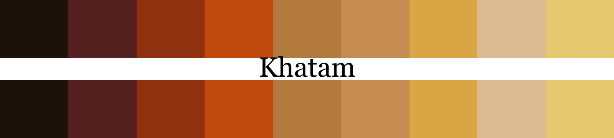
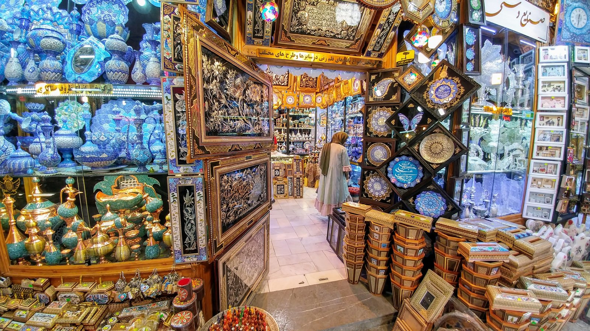
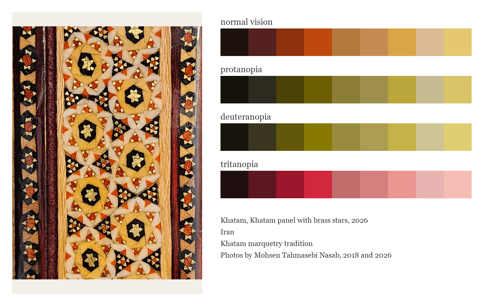
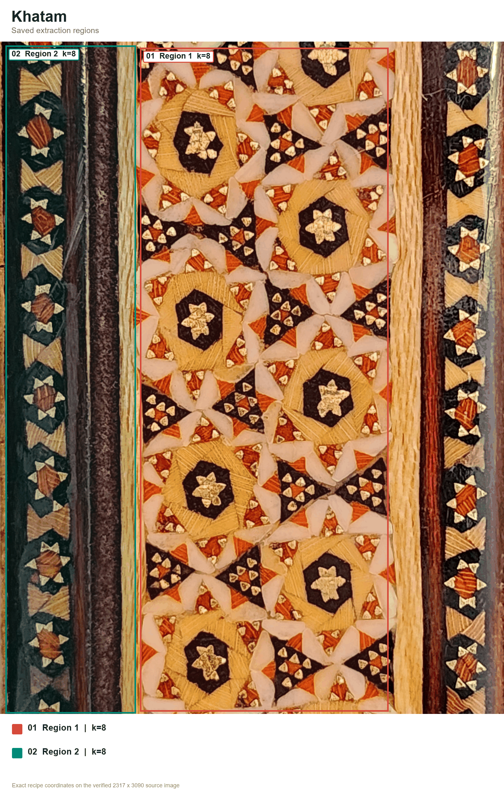
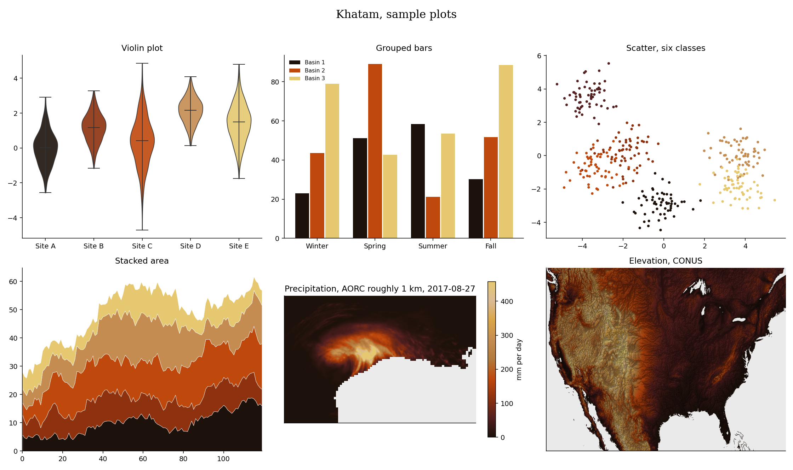

# Khatam (Persian: خاتم, say it khaw-TAM)



This warm ramp comes from khatam marquetry, the Persian craft of laying wood, bone and brass into star patterns. It moves from ebony dark to brass bright. For categories, the pick order jumps between wood, metal and bone.

## Source

Khatam panel with brass stars.
Wood, bone and brass marquetry.
Khatam marquetry tradition.
Photos by Mohsen Tahmasebi Nasab, 2018 and 2026.

[Craft history](https://www.iranicaonline.org/articles/isfahan-xiii-crafts/). Copyright Mohsen Tahmasebi Nasab, all rights reserved.

## The setting



A handicraft shop in the Isfahan bazaar, 2018, khatam boxes stacked in front of minakari enamel and metalwork.

## The craft

Khatam, also called khatam-kari or khatam-sazi, is Persian marquetry made from small pieces of wood, bone and brass. The pieces form dense mosaics of stars and other geometric shapes on boxes, furniture, frames, doors and musical instruments. The geometry does the drawing. In the source photo, each star, dot and triangle comes from the cross section of bundled material.

Encyclopaedia Iranica traces khatam work in Shiraz and Isfahan to at least the Zand period in the late eighteenth century. The craft later declined and was revived in Isfahan during the twentieth century, with palace commissions in Tehran helping it flourish again. Khatam boxes and small objects are still easy to spot in Iranian handicraft shops, like those in the second photograph.

## Colors

| position | hex | drawn from | nearest sample |
|---|---|---|---|
| 1 | `#1c110b` | ebony dark, the stained triangles around each star | 0.3 |
| 2 | `#542020` | maroon, the dyed divider rails | 0.5 |
| 3 | `#8d310e` | russet, orange rods in shadow | 0.7 |
| 4 | `#bf480d` | burnt orange, the brightest rods | 0.4 |
| 5 | `#b27a3c` | oak brown, framing strips | 0.4 |
| 6 | `#c58c51` | light oak, sanded frame edges | 0.5 |
| 7 | `#d9a545` | straw gold, the hexagon field | 0.3 |
| 8 | `#dbba94` | bone, the pale triangles | 0.3 |
| 9 | `#e5c870` | brass, the six point stars | 0.7 |

The last column shows the CIEDE2000 distance to the closest sampled color in
the source photo. Lower numbers mean a closer match.

## The palette beside the artwork



## Extraction regions



These are the saved sampling areas used for CIELAB k-means. The exact pixel
coordinates, normalized coordinates and k values are recorded in the
[Khatam recipe](../../recipes/khatam.json). The regions make the
extraction repeatable. Choosing and refining the final colors still depends
on the artwork and the contributor's eye.

## Sample plots



The rainfall map uses one day of NOAA AORC precipitation on a roughly 1 km grid.
Run `python tools/make_samples.py khatam` to remake the plots. Add
`--dem your_dem.tif` to use your own elevation raster.

## Separation and color vision

| vision | min CIEDE2000 | mean |
|---|---|---|
| normal vision | 6.2 | 32.5 |
| protanopia | 6.5 | 30.3 |
| deuteranopia | 6.0 | 29.3 |
| tritanopia | 3.5 | 29.5 |

The lowest score is 3.5, below Rang's cutoff of 8.

When you ask for fewer colors, the stored pick order spreads them out. Check the finished figure when color distinction matters.

## Use it

Python

```python
import rang

rang.rang("Khatam", 5)              # five well separated colors
rang.cmap("Khatam")                 # smooth matplotlib colormap
rang.cmap("Khatam", 6)              # six fixed steps for classified data

rang.register()                     # then use it anywhere by name
data.plot(cmap="rang:Khatam")
```

R

```r
library(Rang)
library(ggplot2)

rang("Khatam", 5)                   # five well separated colors

# categories
ggplot(df, aes(group, value, fill = group)) +
  geom_col() +
  scale_fill_rang_d("Khatam")

# a numeric variable
ggplot(df, aes(x, y, color = value)) +
  geom_point() +
  scale_color_rang_c("Khatam")
```

ArcGIS Pro users get every palette by importing
[arcgis/Rang.stylx](../../arcgis/Rang.stylx) once, with steps in the
[ArcGIS guide](../../arcgis/README.md). QGIS users can import
[qgis/Rang.xml](../../qgis/Rang.xml) for the ramps or
[qgis/Khatam.gpl](../../qgis/Khatam.gpl) for swatches, see the
[QGIS guide](../../qgis/README.md). HEC-RAS users can import
[hecras/Rang-Khatam.xml](../../hecras/Rang-Khatam.xml), see the
[HEC-RAS guide](../../hecras/README.md). GeoLibre users can copy colors from
[geolibre/Rang.txt](../../geolibre/Rang.txt), with steps for raster and vector
layers in the [GeoLibre guide](../../geolibre/README.md).
