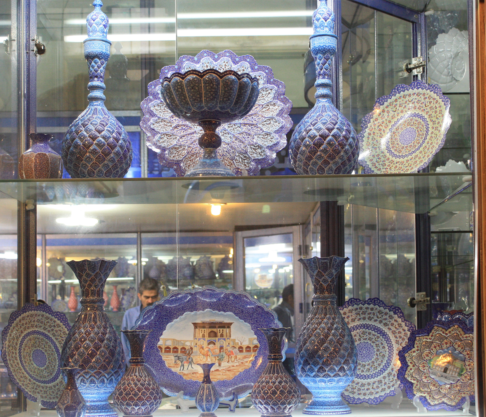
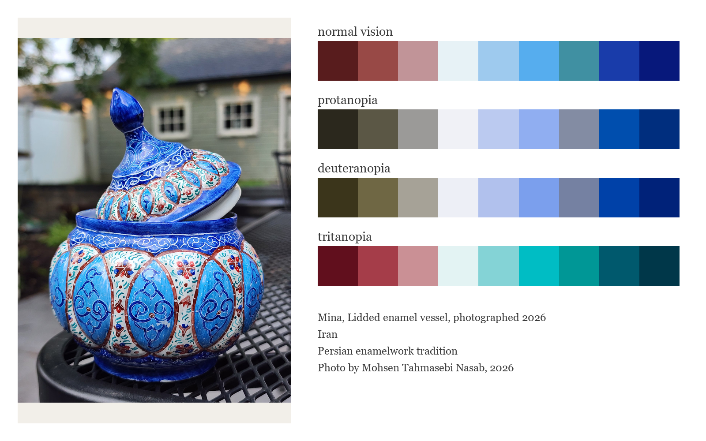
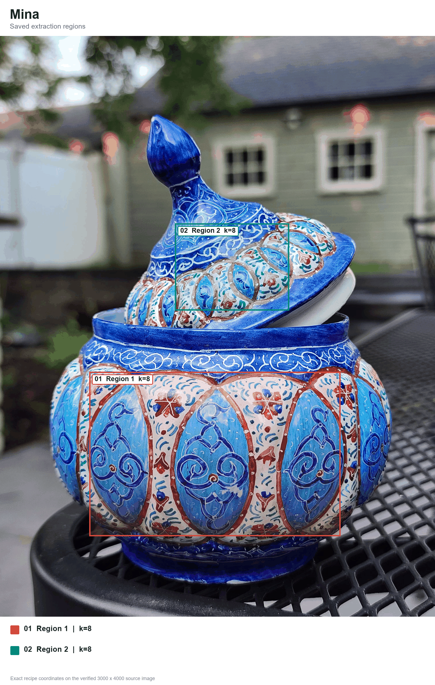
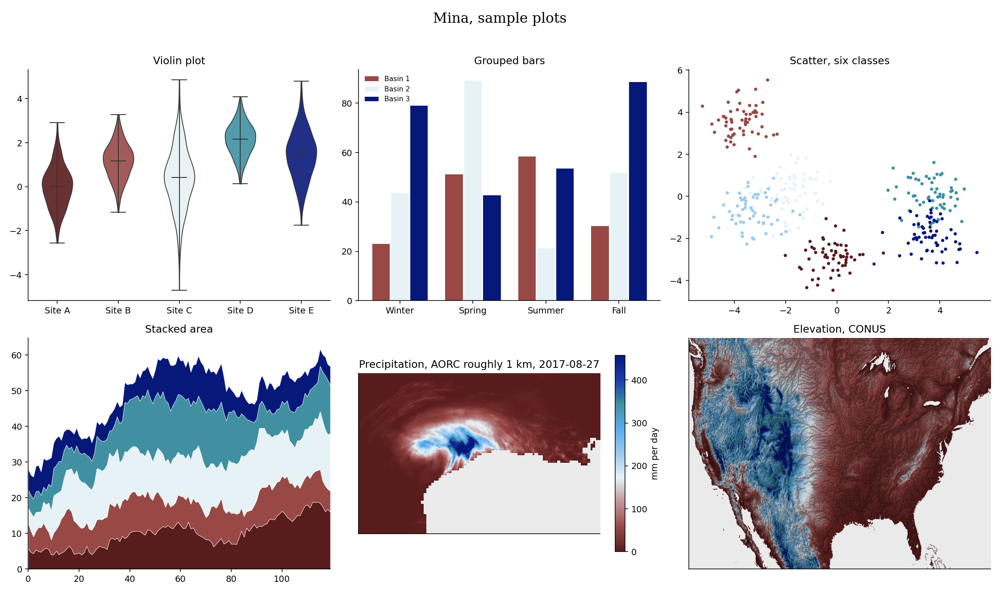

# Mina (Persian: مینا, say it mee-NAH, Persian for enamel)


Mina is Persian for enamel, while minakari is the craft of decorating metal with it. This diverging palette comes from a lidded minakari vessel. Copper and rose meet at an enamel-white center, then turn toward pale blue, turquoise, cobalt and indigo. The blue side dominates, just as it does on the piece.

## Source

Lidded enamel vessel, photographed 2026. Iran.
Painted enamel on metal.
Persian enamelwork tradition.
Photo by Mohsen Tahmasebi Nasab, 2026.

[Craft history](https://www.iranicaonline.org/articles/enamel/). Copyright Mohsen Tahmasebi Nasab, all rights reserved.

## The setting



Minakari enamelware displayed in an Isfahan shop.

Photograph by Wikimedia Commons user مانفی, 2012. Cropped by Joalbertine, 2020. [Context photograph source](https://commons.wikimedia.org/wiki/File:Iranian_vitreous_enamel_(cropped).JPG). Licensed under [CC BY-SA 3.0](https://creativecommons.org/licenses/by-sa/3.0/).

## The craft

Mina is the enamel itself, a heat-fused glass paste colored by metal oxides. Minakari means enamelwork, the craft of decorating metal with that enamel. Persian makers have used the medium for vessels and boxes, often with floral designs, fine detail, royal blue, turquoise and pink.

## Colors

| position | hex | drawn from | nearest sample |
|---|---|---|---|
| 1 | `#581c1d` | deep claret, the darkest red flower strokes | 0.9 |
| 2 | `#984946` | copper red, outlines around the body panels | 1.3 |
| 3 | `#c19498` | dusty rose, sunlit edges of the copper outlines | 0.7 |
| 4 | `#e7f2f6` | enamel white, the floral ground | 0.8 |
| 5 | `#9ecaee` | pale sky, blue-white highlights in the panels | 1.0 |
| 6 | `#56adee` | clear blue, the broad painted leaves and petals | 0.4 |
| 7 | `#4090a2` | turquoise, small leaf strokes across the white ground | 0.7 |
| 8 | `#193caa` | cobalt, the main arabesques and blue bands | 0.3 |
| 9 | `#07187b` | indigo, the deepest outlines and shaded blue enamel | 0.1 |

The last column shows the CIEDE2000 distance to the closest sampled color in
the source photo. Lower numbers mean a closer match.

## The palette beside the artwork



## Extraction regions



These are the saved sampling areas used for CIELAB k-means. The exact pixel
coordinates, normalized coordinates and k values are recorded in the
[Mina recipe](../../recipes/mina.json). The regions make the
extraction repeatable. Choosing and refining the final colors still depends
on the artwork and the contributor's eye.

## Sample plots



The rainfall map uses one day of NOAA AORC precipitation on a roughly 1 km grid.
Run `python tools/make_samples.py mina` to remake the plots. Add
`--dem your_dem.tif` to use your own elevation raster.

## Separation and color vision

| vision | min CIEDE2000 | mean |
|---|---|---|
| normal vision | 10.5 | 40.9 |
| protanopia | 9.9 | 36.2 |
| deuteranopia | 10.4 | 38.0 |
| tritanopia | 9.4 | 44.3 |

The lowest score is 9.4. Rang's cutoff is 8, so all pairwise scores are above it.

When you ask for fewer colors, the stored pick order spreads them out. Check the finished figure when color distinction matters.

## Use it

Python

```python
import rang

rang.rang("Mina", 5)              # five well separated colors
rang.cmap("Mina")                 # smooth matplotlib colormap
rang.cmap("Mina", 6)              # six fixed steps for classified data

rang.register()                     # then use it anywhere by name
data.plot(cmap="rang:Mina")
```

R

```r
library(Rang)
library(ggplot2)

rang("Mina", 5)                   # five well separated colors

# categories
ggplot(df, aes(group, value, fill = group)) +
  geom_col() +
  scale_fill_rang_d("Mina")

# a numeric variable
ggplot(df, aes(x, y, color = value)) +
  geom_point() +
  scale_color_rang_c("Mina")
```

ArcGIS Pro users get every palette by importing
[arcgis/Rang.stylx](../../arcgis/Rang.stylx) once, with steps in the
[ArcGIS guide](../../arcgis/README.md). QGIS users can import
[qgis/Rang.xml](../../qgis/Rang.xml) for the ramps or
[qgis/Mina.gpl](../../qgis/Mina.gpl) for swatches, see the
[QGIS guide](../../qgis/README.md). HEC-RAS users can import
[hecras/Rang-Mina.xml](../../hecras/Rang-Mina.xml), see the
[HEC-RAS guide](../../hecras/README.md). GeoLibre users can copy colors from
[geolibre/Rang.txt](../../geolibre/Rang.txt), with steps for raster and vector
layers in the [GeoLibre guide](../../geolibre/README.md).
