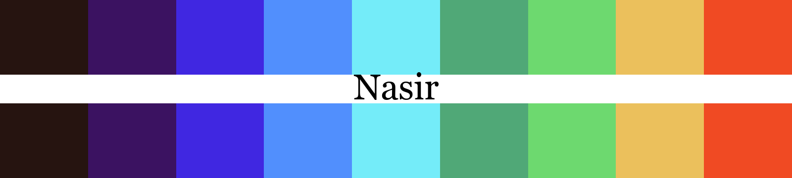
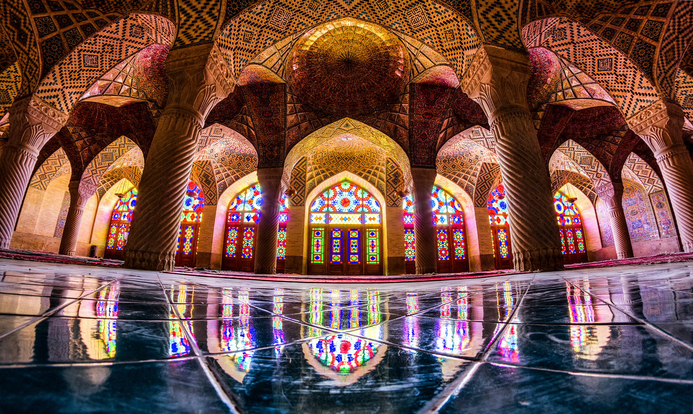
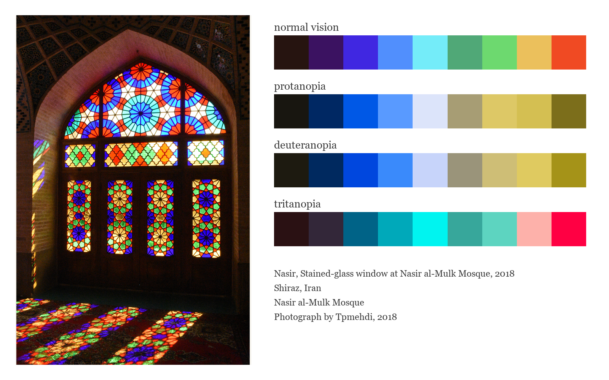
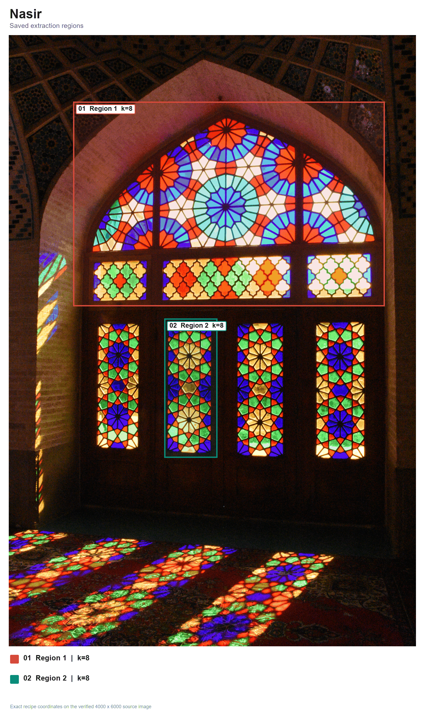
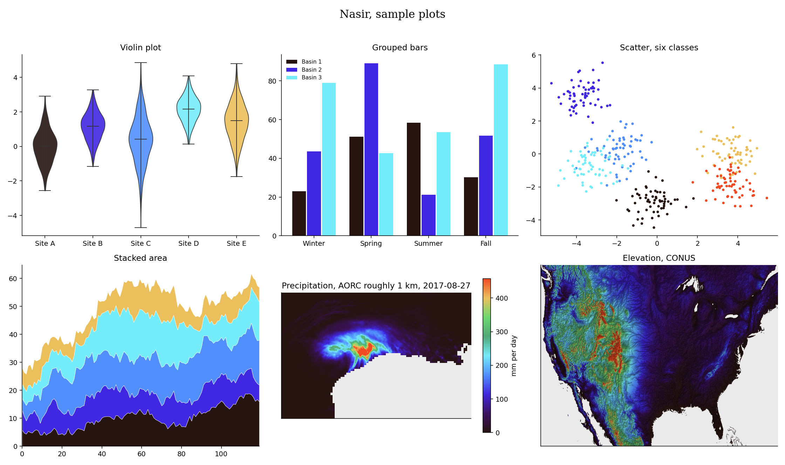

# Nasir (Persian: نصیر, say it nah-SEER, from Nasir al-Mulk Mosque in Shiraz)



This vivid spectrum comes from the stained glass of Nasir al-Mulk Mosque in Shiraz. Violet and cobalt open into cyan and green, then turn through gold to vermilion. I use it when a map or chart needs bright colors and strong contrast.

## Source

Stained-glass window at Nasir al-Mulk Mosque, 2018. Shiraz, Iran.
Digital photograph.
Nasir al-Mulk Mosque.
Photograph by Tpmehdi, 2018.

[Wikimedia Commons source](https://commons.wikimedia.org/wiki/File:DSC_0277-%D9%85%D8%B3%D8%AC%D8%AF_%D9%86%D8%B5%DB%8C%D8%B1%D8%A7%D9%84%D9%85%D9%84%DA%A9.jpg). Licensed under [CC BY-SA 4.0](https://creativecommons.org/licenses/by-sa/4.0/). Rang gallery images use cropped and resized adaptations.

## The setting



Sunlight and stained glass reflected across the prayer hall of Nasir al-Mulk Mosque.

Photograph by MohammadReza Domiri Ganji, 2013. [Context photograph source](https://commons.wikimedia.org/wiki/File:Nasir_al-_mulk_mosque%2C_Shiraz.jpg). Licensed under [CC BY-SA 4.0](https://creativecommons.org/licenses/by-sa/4.0/).

## Colors

| position | hex | drawn from | nearest sample |
|---|---|---|---|
| 1 | `#261410` | deep shadow, the wooden frame and dark interior | 0.5 |
| 2 | `#3b1261` | violet, the smallest rosettes | 0.4 |
| 3 | `#4027e1` | cobalt, pointed panes and flower centers | 1.0 |
| 4 | `#518ffd` | azure, blue glass around the upper fans | 0.7 |
| 5 | `#74ecf9` | cyan, the brightest upper panes | 1.4 |
| 6 | `#50a877` | jade, green rings in the rose windows | 2.2 |
| 7 | `#6dd96f` | spring green, the lower floral panels | 0.6 |
| 8 | `#ebc05c` | gold, the glowing quatrefoils | 1.3 |
| 9 | `#f04a23` | vermilion, red petals and floor reflections | 1.0 |

The last column shows the CIEDE2000 distance to the closest sampled color in
the source photo. Lower numbers mean a closer match.

## The palette beside the artwork



## Extraction regions



These are the saved sampling areas used for CIELAB k-means. The exact pixel
coordinates, normalized coordinates and k values are recorded in the
[Nasir recipe](../../recipes/nasir.json). The regions make the
extraction repeatable. Choosing and refining the final colors still depends
on the artwork and the contributor's eye.

## Sample plots



The rainfall map uses one day of NOAA AORC precipitation on a roughly 1 km grid.
Run `python tools/make_samples.py nasir` to remake the plots. Add
`--dem your_dem.tif` to use your own elevation raster.

## Separation and color vision

| vision | min CIEDE2000 | mean |
|---|---|---|
| normal vision | 15.6 | 51.5 |
| protanopia | 2.8 | 46.4 |
| deuteranopia | 6.1 | 46.0 |
| tritanopia | 9.6 | 47.4 |

The lowest score is 2.8, below Rang's cutoff of 8.

When you ask for fewer colors, the stored pick order spreads them out. Check the finished figure when color distinction matters.

## Use it

Python

```python
import rang

rang.rang("Nasir", 5)              # five well separated colors
rang.cmap("Nasir")                 # smooth matplotlib colormap
rang.cmap("Nasir", 6)              # six fixed steps for classified data

rang.register()                     # then use it anywhere by name
data.plot(cmap="rang:Nasir")
```

R

```r
library(Rang)
library(ggplot2)

rang("Nasir", 5)                   # five well separated colors

# categories
ggplot(df, aes(group, value, fill = group)) +
  geom_col() +
  scale_fill_rang_d("Nasir")

# a numeric variable
ggplot(df, aes(x, y, color = value)) +
  geom_point() +
  scale_color_rang_c("Nasir")
```

ArcGIS Pro users get every palette by importing
[arcgis/Rang.stylx](../../arcgis/Rang.stylx) once, with steps in the
[ArcGIS guide](../../arcgis/README.md). QGIS users can import
[qgis/Rang.xml](../../qgis/Rang.xml) for the ramps or
[qgis/Nasir.gpl](../../qgis/Nasir.gpl) for swatches, see the
[QGIS guide](../../qgis/README.md). HEC-RAS users can import
[hecras/Rang-Nasir.xml](../../hecras/Rang-Nasir.xml), see the
[HEC-RAS guide](../../hecras/README.md). GeoLibre users can copy colors from
[geolibre/Rang.txt](../../geolibre/Rang.txt), with steps for raster and vector
layers in the [GeoLibre guide](../../geolibre/README.md).
