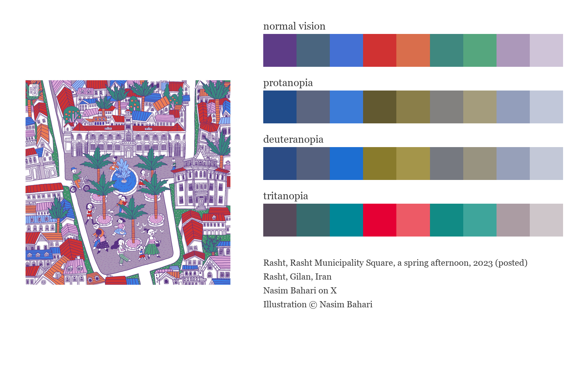
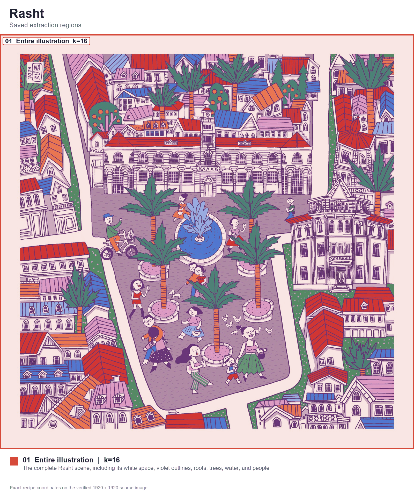
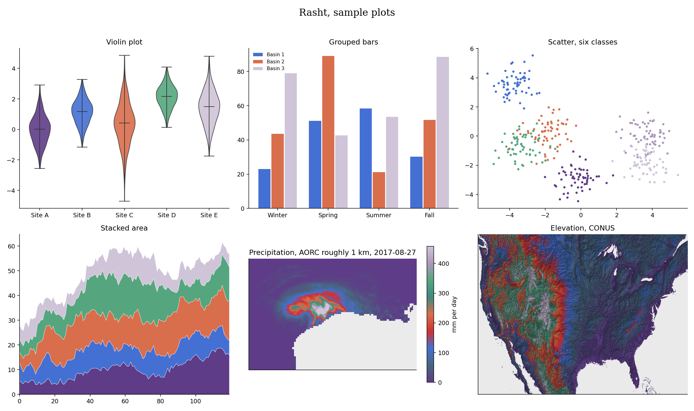

# Rasht (Persian: رشت, say it rasht)


Rasht draws nine colors from Nasim Bahari's illustration of Municipality Square on a spring afternoon. Deep violet and two blues lead into neighboring red and orange roof colors, two greens from the palms, and the lavender paving and pale architectural details.

## Source

Nasim Bahari, illustration of Rasht Municipality Square, posted 2023.
Illustration.
Nasim Bahari on X.
Illustration © Nasim Bahari.

[Artist's original post](https://x.com/BahariiNasim/status/1652295181847212032). Copyright Nasim Bahari, all rights reserved. The source image and derived previews are included for this Rang contribution with permission obtained by the palette creator from the artist. No general license to reuse the artwork is granted here.

## The story

Bahari's illustration looks across Rasht's Municipality Square toward its clock-fronted building. People walk, cycle, and pause among the trees and fountain. Layers of red and blue roofs frame the square. The artist described it as an afternoon on a spring day in Rasht.

## Colors

| position | hex | drawn from | nearest sample |
|---|---|---|---|
| 1 | `#5e3c87` | deep violet in the building outlines and small shadowed details | 0.6 |
| 2 | `#4a657f` | slate blue in the roof and architectural shadows | 0.5 |
| 3 | `#4470d3` | clear blue roofs and the central fountain | 0.7 |
| 4 | `#d03232` | red roofs around Municipality Square | 0.0 |
| 5 | `#d96e4c` | warm orange roof details, trunks, and clothing | 2.4 |
| 6 | `#3f887f` | deep green of the palms and planted edges | 0.1 |
| 7 | `#55a67e` | lighter green in the palms and planted edges | 0.7 |
| 8 | `#ac98ba` | lavender of the broad square pavement | 0.0 |
| 9 | `#cfc4d8` | pale lilac in walls and roof details | 0.0 |

The last column shows the CIEDE2000 distance to the closest sampled color in
the source photo. Lower numbers mean a closer match.

## The palette beside the artwork



## Extraction regions



These are the saved sampling areas used for CIELAB k-means. The exact pixel
coordinates, normalized coordinates and k values are recorded in the
[Rasht recipe](../../recipes/rasht.json). The regions make the
extraction repeatable. Choosing and refining the final colors still depends
on the artwork and the contributor's eye.

## Sample plots



The rainfall map uses one day of NOAA AORC precipitation on a roughly 1 km grid.
Run `python tools/make_samples.py rasht` to remake the plots. Add
`--dem your_dem.tif` to use your own elevation raster.

## Separation and color vision

| vision | min CIEDE2000 | mean |
|---|---|---|
| normal vision | 10.7 | 35.1 |
| protanopia | 11.9 | 28.9 |
| deuteranopia | 9.4 | 29.4 |
| tritanopia | 8.9 | 36.5 |

The lowest score is 8.9. Rang's cutoff is 8, so all pairwise scores are above it.

When you ask for fewer colors, the stored pick order spreads them out. Check the finished figure when color distinction matters.

## Use it

Python

```python
import rang

rang.rang("Rasht", 5)              # five well separated colors
rang.cmap("Rasht")                 # smooth matplotlib colormap
rang.cmap("Rasht", 6)              # six fixed steps for classified data

rang.register()                     # then use it anywhere by name
data.plot(cmap="rang:Rasht")
```

R

```r
library(Rang)
library(ggplot2)

rang("Rasht", 5)                   # five well separated colors

# categories
ggplot(df, aes(group, value, fill = group)) +
  geom_col() +
  scale_fill_rang_d("Rasht")

# a numeric variable
ggplot(df, aes(x, y, color = value)) +
  geom_point() +
  scale_color_rang_c("Rasht")
```

ArcGIS Pro users get every palette by importing
[arcgis/Rang.stylx](../../arcgis/Rang.stylx) once, with steps in the
[ArcGIS guide](../../arcgis/README.md). QGIS users can import
[qgis/Rang.xml](../../qgis/Rang.xml) for the ramps or
[qgis/Rasht.gpl](../../qgis/Rasht.gpl) for swatches, see the
[QGIS guide](../../qgis/README.md). HEC-RAS users can import
[hecras/Rang-Rasht.xml](../../hecras/Rang-Rasht.xml), see the
[HEC-RAS guide](../../hecras/README.md). GeoLibre users can copy colors from
[geolibre/Rang.txt](../../geolibre/Rang.txt), with steps for raster and vector
layers in the [GeoLibre guide](../../geolibre/README.md).
