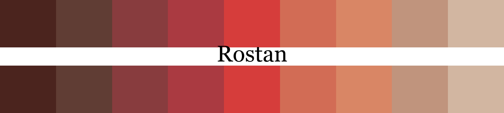
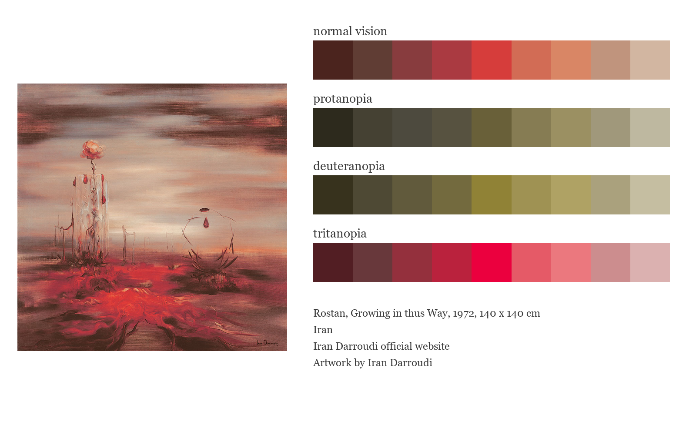
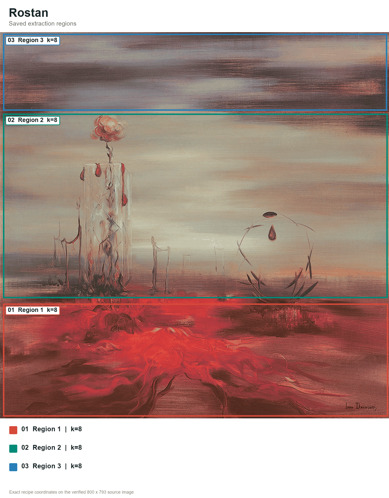
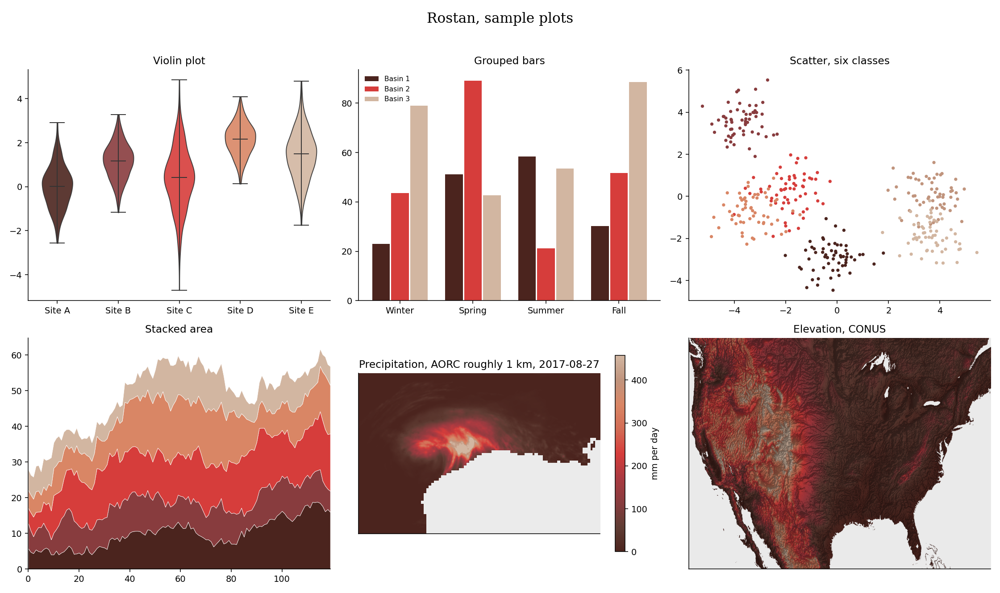

# Rostan (Persian: رستن, say it rohs-TAN, from the Persian title Az In Gooneh Rostan)



Rostan comes from Iran Darroudi's 1972 painting Az In Gooneh Rostan, or Growing in thus Way. Near-black earth rises through wine and urgent crimson, then opens into coral, dusty rose and a pale sky. To me, the red feels both wounded and alive, while the quieter tones hold the scene in stillness.

## Source

Growing in thus Way, 1972, 140 x 140 cm.
Painting.
Iran Darroudi official website.
Artwork by Iran Darroudi.
[Artist biography](https://www.irandarroudi.com/en/biography).
The English title follows the wording on the artist's official website.

[Official artwork page](https://www.irandarroudi.com/en/paints). Copyright Iran Darroudi, all rights reserved. This low-resolution reference image is included for identification and commentary only.

## Colors

| position | hex | drawn from | nearest sample |
|---|---|---|---|
| 1 | `#4b241e` | near-black umber, the deepest marks and scorched ground | 0.5 |
| 2 | `#603d34` | smoked brown, the horizontal bands across the upper sky | 0.4 |
| 3 | `#883c3e` | wine red, shadowed growth along the lower edge | 0.0 |
| 4 | `#aa3a41` | crimson, the tangled forms rising from the earth | 0.2 |
| 5 | `#d63d3b` | scarlet, the brightest and most insistent red | 0.3 |
| 6 | `#d26c55` | warm coral, light caught along the red forms | 0.3 |
| 7 | `#d98665` | bloom coral, the flower above the central structure | 0.3 |
| 8 | `#c0947d` | dusty rose, the softened bands of distant haze | 0.3 |
| 9 | `#d2b6a1` | pale sand, the quiet light across the open sky | 0.0 |

The last column shows the CIEDE2000 distance to the closest sampled color in
the source photo. Lower numbers mean a closer match.

## The palette beside the artwork



## Extraction regions



These are the saved sampling areas used for CIELAB k-means. The exact pixel
coordinates, normalized coordinates and k values are recorded in the
[Rostan recipe](../../recipes/rostan.json). The regions make the
extraction repeatable. Choosing and refining the final colors still depends
on the artwork and the contributor's eye.

## Sample plots



The rainfall map uses one day of NOAA AORC precipitation on a roughly 1 km grid.
Run `python tools/make_samples.py rostan` to remake the plots. Add
`--dem your_dem.tif` to use your own elevation raster.

## Separation and color vision

| vision | min CIEDE2000 | mean |
|---|---|---|
| normal vision | 7.0 | 24.3 |
| protanopia | 3.0 | 21.6 |
| deuteranopia | 5.2 | 21.9 |
| tritanopia | 6.7 | 23.5 |

The lowest score is 3.0, below Rang's cutoff of 8.

When you ask for fewer colors, the stored pick order spreads them out. Check the finished figure when color distinction matters.

## Use it

Python

```python
import rang

rang.rang("Rostan", 5)              # five well separated colors
rang.cmap("Rostan")                 # smooth matplotlib colormap
rang.cmap("Rostan", 6)              # six fixed steps for classified data

rang.register()                     # then use it anywhere by name
data.plot(cmap="rang:Rostan")
```

R

```r
library(Rang)
library(ggplot2)

rang("Rostan", 5)                   # five well separated colors

# categories
ggplot(df, aes(group, value, fill = group)) +
  geom_col() +
  scale_fill_rang_d("Rostan")

# a numeric variable
ggplot(df, aes(x, y, color = value)) +
  geom_point() +
  scale_color_rang_c("Rostan")
```

ArcGIS Pro users get every palette by importing
[arcgis/Rang.stylx](../../arcgis/Rang.stylx) once, with steps in the
[ArcGIS guide](../../arcgis/README.md). QGIS users can import
[qgis/Rang.xml](../../qgis/Rang.xml) for the ramps or
[qgis/Rostan.gpl](../../qgis/Rostan.gpl) for swatches, see the
[QGIS guide](../../qgis/README.md). HEC-RAS users can import
[hecras/Rang-Rostan.xml](../../hecras/Rang-Rostan.xml), see the
[HEC-RAS guide](../../hecras/README.md). GeoLibre users can copy colors from
[geolibre/Rang.txt](../../geolibre/Rang.txt), with steps for raster and vector
layers in the [GeoLibre guide](../../geolibre/README.md).
