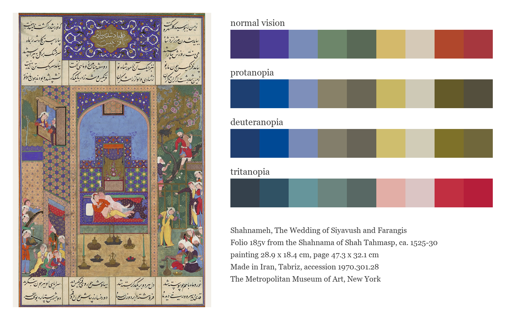
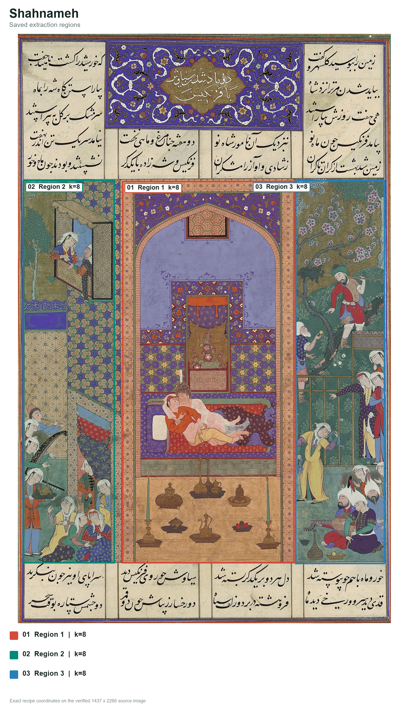
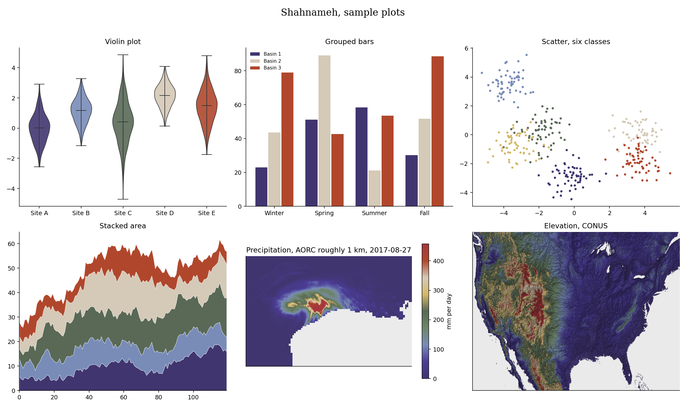

# Shahnameh (Persian: شاهنامه, say it shah-nah-MEH, Persian for Book of Kings)


Shahnameh comes from the wedding of Siyavush and Farangis. Deep violet and pavilion blue give the page its quiet center, while garden green, gold, parchment and red carry the celebration around it. I wanted the palette to hold both the stillness of the couple and the music outside their room.

## Source

The Wedding of Siyavush and Farangis, folio 185v from the Shahnama of Shah Tahmasp, ca. 1525-30.
Painting attributed to Qasim ibn 'Ali, workshop directed by Mir Musavvir.
Opaque watercolor, ink, silver and gold on paper.
The Metropolitan Museum of Art, New York, Islamic Art, accession 1970.301.28.
Gift of Arthur A. Houghton Jr., 1970.

[Object page](https://www.metmuseum.org/art/collection/search/452137) and [full resolution photo](https://images.metmuseum.org/CRDImages/is/original/DP107144.jpg), released by the museum under open access.

## The story

The [Shahnameh](https://shahnameh.fitzmuseum.cam.ac.uk/literary), or Book of Kings, is Ferdowsi's great Persian epic. It gathers Iran's legendary and historical past into verse. Its lasting importance lies not only in the stories, but also in the way Ferdowsi strengthened Persian as a literary language and carried cultural memory across generations.

Siyavush is the son of the Iranian shah Kai Kavus. After trouble with his father drives him into exile in Turan, he marries Farangis, the daughter of Afrasiyab. Their son Kai Khusrau will later become shah of Iran. The miniature places the couple together inside a pavilion while musicians, attendants and guests fill the terraces and garden. The quiet embrace at the center makes the surrounding celebration feel even more alive.

## Colors

| position | hex | drawn from | nearest sample |
|---|---|---|---|
| 1 | `#41356f` | deep indigo, shadows in the illuminated heading | 0.3 |
| 2 | `#4b3d97` | royal violet, the floral panels and bed textiles | 0.2 |
| 3 | `#798cb8` | pavilion blue, the broad wall behind the couple | 0.0 |
| 4 | `#6d866a` | jade, the geometric tilework and clothing | 0.5 |
| 5 | `#596956` | garden green, trees and foliage around the guests | 0.4 |
| 6 | `#d4b96b` | soft gold, the chamber floor and yellow garments | 0.7 |
| 7 | `#d5c9b7` | parchment, the page and pale architectural details | 0.4 |
| 8 | `#b0472c` | vermilion, robes and warm textile accents | 0.8 |
| 9 | `#a6373e` | crimson, the bedcover and flowering details | 0.6 |

The last column shows the CIEDE2000 distance to the closest sampled color in
the source photo. Lower numbers mean a closer match.

## The palette beside the artwork



## Extraction regions



These are the saved sampling areas used for CIELAB k-means. The exact pixel
coordinates, normalized coordinates and k values are recorded in the
[Shahnameh recipe](../../recipes/shahnameh.json). The regions make the
extraction repeatable. Choosing and refining the final colors still depends
on the artwork and the contributor's eye.

## Sample plots



The rainfall map uses one day of NOAA AORC precipitation on a roughly 1 km grid.
Run `python tools/make_samples.py shahnameh` to remake the plots. Add
`--dem your_dem.tif` to use your own elevation raster.

## Separation and color vision

| vision | min CIEDE2000 | mean |
|---|---|---|
| normal vision | 7.4 | 36.9 |
| protanopia | 6.9 | 32.9 |
| deuteranopia | 6.5 | 32.9 |
| tritanopia | 3.8 | 33.1 |

The lowest score is 3.8, below Rang's cutoff of 8.

When you ask for fewer colors, the stored pick order spreads them out. Check the finished figure when color distinction matters.

## Use it

Python

```python
import rang

rang.rang("Shahnameh", 5)              # five well separated colors
rang.cmap("Shahnameh")                 # smooth matplotlib colormap
rang.cmap("Shahnameh", 6)              # six fixed steps for classified data

rang.register()                     # then use it anywhere by name
data.plot(cmap="rang:Shahnameh")
```

R

```r
library(Rang)
library(ggplot2)

rang("Shahnameh", 5)                   # five well separated colors

# categories
ggplot(df, aes(group, value, fill = group)) +
  geom_col() +
  scale_fill_rang_d("Shahnameh")

# a numeric variable
ggplot(df, aes(x, y, color = value)) +
  geom_point() +
  scale_color_rang_c("Shahnameh")
```

ArcGIS Pro users get every palette by importing
[arcgis/Rang.stylx](../../arcgis/Rang.stylx) once, with steps in the
[ArcGIS guide](../../arcgis/README.md). QGIS users can import
[qgis/Rang.xml](../../qgis/Rang.xml) for the ramps or
[qgis/Shahnameh.gpl](../../qgis/Shahnameh.gpl) for swatches, see the
[QGIS guide](../../qgis/README.md). HEC-RAS users can import
[hecras/Rang-Shahnameh.xml](../../hecras/Rang-Shahnameh.xml), see the
[HEC-RAS guide](../../hecras/README.md). GeoLibre users can copy colors from
[geolibre/Rang.txt](../../geolibre/Rang.txt), with steps for raster and vector
layers in the [GeoLibre guide](../../geolibre/README.md).
