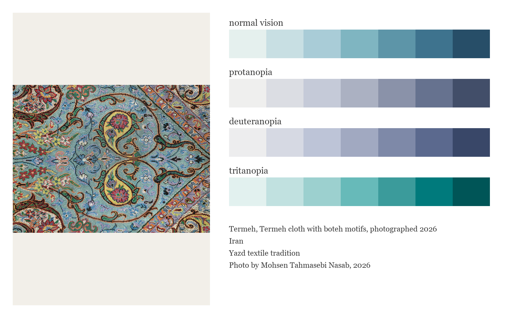
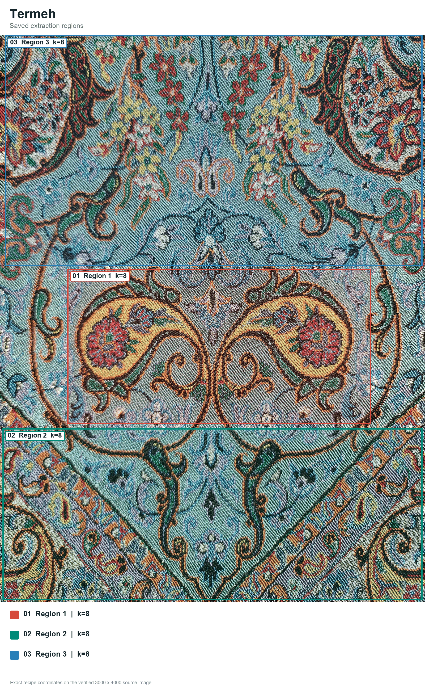
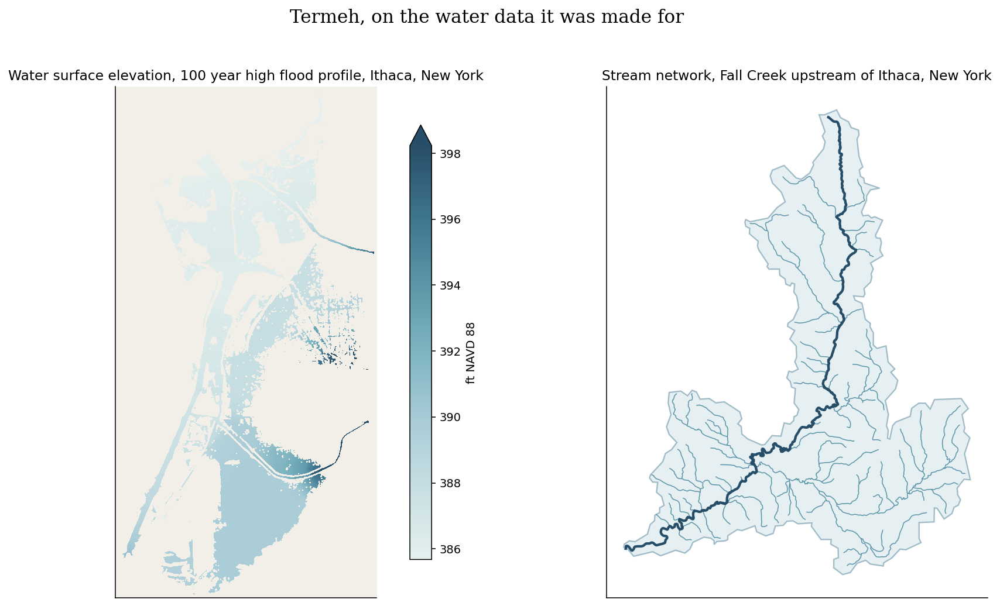

# Termeh (Persian: ترمه, say it tehr-MEH)


I made this sequential ramp for water surface elevation and depth rasters. It follows the termeh's blue ground from foam light to deep indigo. The color names come from the water they are meant to carry: Foam Mist, Glacial Blue, Powder Aqua, River Teal, Slate Blue, Deep Channel and Night Current.

## Source

Termeh cloth with boteh motifs, photographed 2026. Iran.
Textile.
Yazd textile tradition.
Photo by Mohsen Tahmasebi Nasab, 2026.

[Tradition reference](https://asia-archive.si.edu/object/S2017.14/). Copyright Mohsen Tahmasebi Nasab, all rights reserved.

## The setting


Termeh at rest, a draped cloth, runners and a covered chest.

## Colors

| position | hex | drawn from | nearest sample |
|---|---|---|---|
| 1 | `#e5f0ee` | Foam Mist, white thread highlights | 0.9 |
| 2 | `#c8dfe3` | Glacial Blue, pale silk detailing | 0.7 |
| 3 | `#a9ccd7` | Powder Aqua, light ground between motifs | 0.5 |
| 4 | `#7fb5c1` | River Teal, the twill ground itself | 0.8 |
| 5 | `#5d95a8` | Slate Blue, shaded folds of the ground | 1.1 |
| 6 | `#3e738e` | Deep Channel, blue fill of the boteh | 0.3 |
| 7 | `#274e68` | Night Current, the darkest indigo threads | 0.5 |

The last column shows the CIEDE2000 distance to the closest sampled color in
the source photo. Lower numbers mean a closer match.

## The palette beside the artwork



## Extraction regions



These are the saved sampling areas used for CIELAB k-means. The exact pixel
coordinates, normalized coordinates and k values are recorded in the
[Termeh recipe](../../recipes/termeh.json). The regions make the
extraction repeatable. Choosing and refining the final colors still depends
on the artwork and the contributor's eye.

## Sample plots



Both maps use USGS data. The first shows the 100 year high flood
profile for the creeks at Ithaca, New York. The second follows Fall
Creek, with stream widths drawn from NHDPlusV2 order in USGS Fabric.
The watershed interior has no fill.
Run `python tools/make_samples.py termeh` to remake them.

## Separation and color vision

| vision | min CIEDE2000 | mean |
|---|---|---|
| normal vision | 6.2 | 24.6 |
| protanopia | 5.2 | 23.3 |
| deuteranopia | 6.0 | 24.7 |
| tritanopia | 6.8 | 24.6 |

The lowest score is 5.2, below Rang's cutoff of 8.

When you ask for fewer colors, the stored pick order spreads them out. Check the finished figure when color distinction matters.

## Use it

Python

```python
import rang

rang.rang("Termeh", 5)              # five well separated colors
rang.cmap("Termeh")                 # smooth matplotlib colormap
rang.cmap("Termeh", 6)              # six fixed steps for classified data

rang.register()                     # then use it anywhere by name
data.plot(cmap="rang:Termeh")
```

R

```r
library(Rang)
library(ggplot2)

rang("Termeh", 5)                   # five well separated colors

# categories
ggplot(df, aes(group, value, fill = group)) +
  geom_col() +
  scale_fill_rang_d("Termeh")

# a numeric variable
ggplot(df, aes(x, y, color = value)) +
  geom_point() +
  scale_color_rang_c("Termeh")
```

ArcGIS Pro users get every palette by importing
[arcgis/Rang.stylx](../../arcgis/Rang.stylx) once, with steps in the
[ArcGIS guide](../../arcgis/README.md). QGIS users can import
[qgis/Rang.xml](../../qgis/Rang.xml) for the ramps or
[qgis/Termeh.gpl](../../qgis/Termeh.gpl) for swatches, see the
[QGIS guide](../../qgis/README.md). HEC-RAS users can import
[hecras/Rang-Termeh.xml](../../hecras/Rang-Termeh.xml), see the
[HEC-RAS guide](../../hecras/README.md). GeoLibre users can copy colors from
[geolibre/Rang.txt](../../geolibre/Rang.txt), with steps for raster and vector
layers in the [GeoLibre guide](../../geolibre/README.md).
