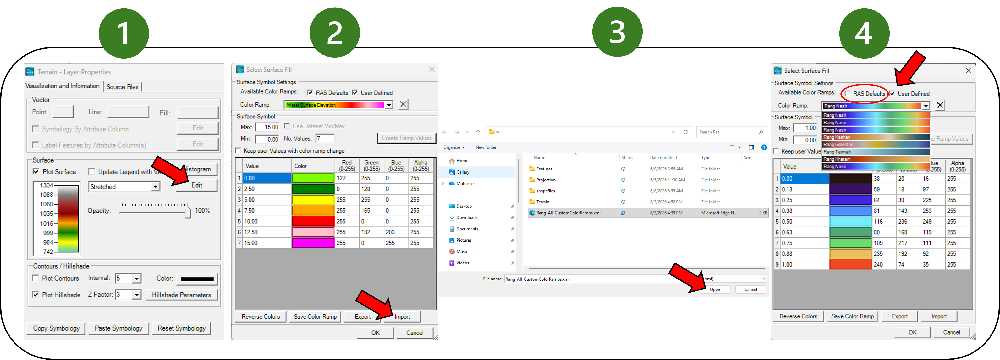

# Rang in HEC-RAS

Rang palettes can be imported through the HEC-RAS interface as user-defined
color ramps. Download [Rang-All.xml](Rang-All.xml) to add the full collection,
or choose an individual `Rang-<Name>.xml` file from this folder.

Save your current HEC-RAS changes before importing. HEC-RAS warns that any
unsaved changes in the Surface Fill window will be lost.

## Import a color ramp

1. In RAS Mapper, right-click the layer whose color ramp you want to change.
2. Click **Image Display Properties**, the first option in the menu.
3. In **Layer Properties**, click **Edit** beside the surface display.
4. In the **Select Surface Fill** window, click **Import**.
5. When HEC-RAS warns that unsaved changes will be lost, click **Yes**.
6. In the Browse window, select `Rang-All.xml` or an individual Rang XML file,
   then click **Open**.
7. Clear **RAS Defaults** and select **User Defined**.
8. Open the **Color Ramp** list and choose a palette such as
   **Rang - Golestan**.
9. Click **OK** to apply the ramp.

## Files

- `Rang-All.xml` contains every palette and is the simplest way to install the
  full collection.
- `Rang-<Name>.xml` contains one palette when you only want a single ramp.

The files are generated from `palettes/*.json` by `tools/build.py`. Adding a
new palette and running the build updates the individual files and
`Rang-All.xml` automatically.
